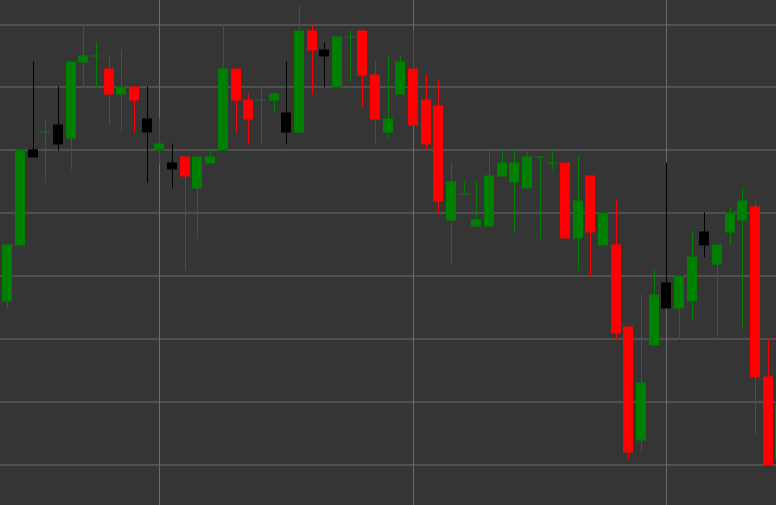

# 看跌K线形态

看跌K线是一种K线形态，其特点是收盘价低于开盘价。该形态显示了看跌的市场情绪。

##### 主要特点：

- 开盘价高于收盘价（O > C）。
- 表示市场上的看跌压力。

### 解释

看跌K线表示市场看跌情绪，具有以下几个特点：

- 长上影线表示买家试图将价格推高，但卖家掌控了局面。
- 收盘低于开盘显示在该时段末卖方占主导地位。
- K线实体与上影线的比例显示了在测试上方水平后卖方的力量。
- 在上升趋势中，它可能预示潜在的反转或修正。
- 在下跌趋势中，它确认了趋势的强度，尤其是在反弹之后。

### 交易策略

看跌K线可以用于各种交易策略：

- 在阻力位形成看跌K线或在超买区时建立空头持仓。
- 将止损设在K线最高点之上，以防进一步上涨。
- 结合其他技术指标或模式以提高交易成功的可能性。
- 用来确认来自指标（如MACD或移动平均线）的下跌信号。
- 注意交易量——高交易量增强信号的重要性。
- 当此模式出现在上升趋势中时，可能用于平仓或部分获利了结。

## 另请参阅

[看涨K线形态](bullish.md)

[看跌K线形态](black_candle.md)