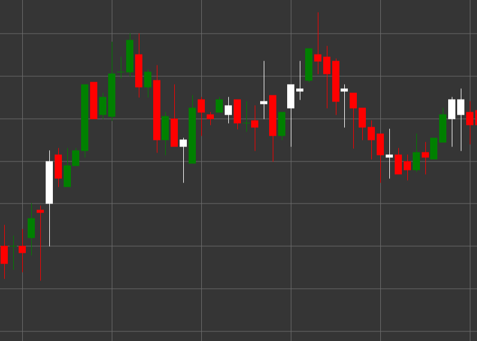

# 看涨K线形态

看涨K线是一种K线形态，其特点是收盘价高于开盘价。该形态显示了看涨的市场情绪。

##### 主要特点：

- 开盘价低于收盘价（O < C）。
- 表示市场上的看涨压力。

### 解释

看涨K线表示市场看涨情绪，具有以下几个特点：

- 长下影线表示卖方试图将价格压低，但买方掌控了局面。
- 收盘高于开盘显示在该时段结束时买方占据主导地位。
- K线实体与下影线的比例显示了在测试较低水平后买方的力量。
- 在下跌趋势中，它可能预示着潜在的反转。
- 在上升趋势中，它确认了趋势的强度，尤其是在调整之后。

### 交易策略

看涨K线可以用于各种交易策略：

- 在支撑位或超卖区出现看涨K线形态后建立多头持仓。
- 在K线的最低点下方设置止损，以防止进一步下跌。
- 结合其他技术指标或模式以提高交易成功的可能性。
- 用来确认来自指标（如MACD或移动平均线）的上涨趋势信号。
- 注意交易量——高交易量增强信号的重要性。

## 另请参阅

[看跌K线形态](bearish.md)

[看涨白K线形态](white_candle.md)