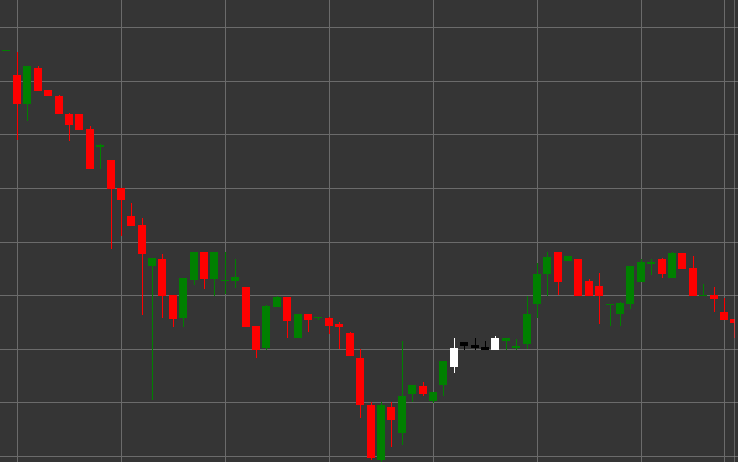

# 上涨三法形态

三步上升形态是一种看涨趋势延续形态，由五根K线组成，出现在上升趋势中。该形态显示了在现有上升趋势中持续前进前的短暂整合或休整。

##### 主要特点：

- 第一根K线是白色（看涨），开盘价低于收盘价（O < C），并且实体较长。
- 接下来的三根K线是黑色（看跌），开盘价高于收盘价（O > C），实体较小：(B < pB * 0.5m)，(B < ppB * 0.5m)，(B < pppB * 0.5m)。
- 三根中间K线的实体没有超出第一根K线的范围。
- 第五根K线是白色（看涨），开盘价低于收盘价（O < C），且实体较长（B > pB * 2）。
- 第五根K线突破了第一根K线的高点并收于更高的位置。
- 处于上升趋势的形态。

### 解释

上涨三法被认为是上涨趋势延续的可靠信号：

- 第一根长白K线显示了上涨趋势的强度。
- 三根小黑K线表示一个暂时的整合或回调，在此期间卖方未能显著改变趋势。
- 第五根长白K线确认了控制权回到买家手中，并且上升趋势将继续。
- 在经典技术分析中，这种形态可以被看作是旗形或小旗形。
- 这样的一系列K线表明，在继续上涨之前，回调被用来积累多头持仓。

### 交易策略

上涨三法为建立或加强多头持仓提供了良好的机会：

- 在第五根K线开盘后或第一根K线的最高价突破时开多仓。
- 将止损置于回调K线的最低点下方或第一根K线的最低点下方。
- 目标利润可以使用从趋势开始到形态第一个K线的距离的投影来设定。
- 注意成交量——理想情况下，中间三根K线的成交量下降，而第五根K线的成交量显著增加。
- 结合其他技术指标来确认信号。
- 考虑当前价格之上可能影响走势发展的重要阻力位。

## 另请参阅

[三法下降形态](falling_three_methods.md)

[三白兵形态](three_white_soldiers.md)