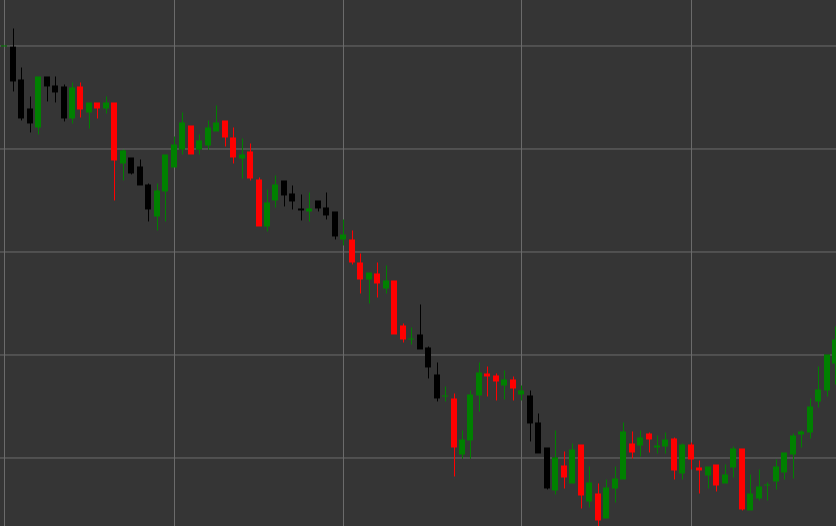

# 三只乌鸦形态

三只乌鸦是一种强烈的看跌反转K线形态，由三根连续的K线组成，出现在上升趋势中。该形态表明从买方到卖方的控制发生了决定性的转变，预示着上升趋势可能出现反转。

##### 主要特点：

- 连续三根阴线（看跌），开盘价高于收盘价（O > C）。
- 每根后续K线的开盘价都位于前一根K线的实体内（O < pO）。
- 每根K线的收盘价都低于前一根K线的收盘价。
- 所有三根K线的实体相对较长，影线较短。
- 处于上升趋势的形态。

### 解释

三只乌鸦被认为是上升趋势反转最可靠的信号之一：

- 三根递减的K线序列显示出看跌压力的稳步增加。
- 在前一根K线实体内，每根随后的K线的开盘表明某种整合，然后是看跌趋势的延续。
- 每一根K线收盘价低于前一根，表明卖方能够持续降低价格的能力。
- 相对较长的K线实体伴随短影线表明空方对市场的决定性控制。
- 三根K线的大小越均匀，信号就越强。

### 交易策略

三只乌鸦为建立空头持仓提供了可靠的机会：

- 在完整形态形成后开设空头持仓，通常在第四根K线的开盘时。
- 将止损置于第三根K线的高点上方或整个形态的高点上方。
- 目标利润可以基于斐波那契水平或先前的支撑水平来设定。
- 注意成交量——每根K线成交量的增加确认了信号的强度。
- 对实体极长的K线应更加谨慎，因为市场超卖时可能会出现短期调整。
- 结合其他技术指标，例如处于超买区的RSI，以提高交易成功的概率。
- 如果该形态在长期上升趋势之后或在重要阻力位形成，则信号特别强。

## 另请参阅

[三白兵形态](three_white_soldiers.md)

[跌三法形态](falling_three_methods.md)
