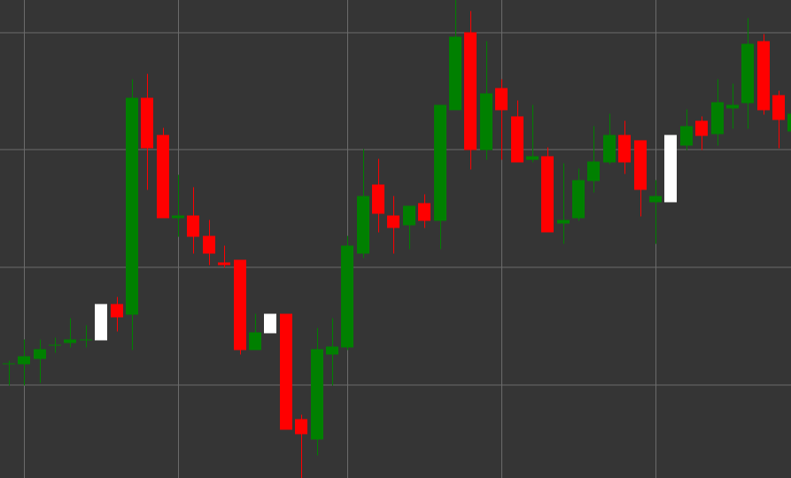

# 白色光头光脚阳线形态

白色光头光脚阳线是一种看涨的K线形态，其特点是K线两端没有影线。术语“marubozu”来源于日语，意为“光头”或“剃光头”，反映了K线没有影线的外观。

##### 主要特点：

- 开盘价低于收盘价（O < C）。
- K线实体完全充满，没有上下影线。
- 开盘价等于K线的最低价，收盘价等于K线的最高价。
- 表示强烈的看涨走势，期间买方控制了价格。

### 解释

白色光头光脚阳线被认为是一个强烈的看涨信号：

- 影线的缺失表明买方完全占优——价格从低点开盘，并持续上涨直到该周期结束。
- 一根长白实体阳线表示非常强的多头压力。
- 在下跌趋势之后出现此形态可能预示着反转。
- 在上升趋势中，它确认了走势的强度。

### 交易策略

白色光头光脚阳线比普通白色K线提供更强的信号：

- 在形成白色光头光脚阳线后，有机会建立多头持仓，尤其是当它出现在重要支撑位时。
- 在设置止损时使用白色光头光脚阳线的收盘价作为支撑位。
- 结合其他技术指标来确认信号。
- 注意交易量——高交易量增强信号的重要性。

## 另请参阅

[黑色光头光脚阴线形态](black_marubozu.md)

[白色K线形态](white_candle.md)
