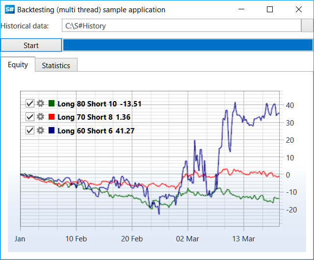

# 优化

为了优化[回测](historical_data.md)过程，可以使用基于多线程的并行计算。在具有多个核心或处理器的计算机上，由于多个操作的并发执行，这将减少总体测试时间。

> [!CAUTION]
> 使用多个线程会增加内存消耗（大约与创建的线程数量相同，如果每个线程使用其在历史中的时间范围）。因此，在内存不足的情况下使用并行测试，将无法显著提高性能，甚至可能降低性能。

## 在多个线程中测试移动平均线策略的示例

1. 以[历史数据](historical_data.md) 测试部分中描述的 SampleHistoryTesting 示例为基础。该示例是一个经过修改的常规测试，用于通过拟合移动平均长度的最优值进行优化测试：
2. 创建几个移动平均线长度的设置（第一个值负责最长的长度，第二个值负责最短的长度，第三个值负责权益曲线的颜色）：

   ```cs
   var periods = new[]
   {
   	new Tuple<int, int, Color>(80, 10, Colors.DarkGreen),
   	new Tuple<int, int, Color>(70, 8, Colors.Red),
   	new Tuple<int, int, Color>(60, 6, Colors.DarkBlue)
   };
   ```
3. 创建存储、工具和消息的实例，以设置 Level1 和投资组合的值：

   ```cs
   					
   // storage to historical data
   var storageRegistry = new StorageRegistry
   {
   	// set historical path
   	DefaultDrive = new LocalMarketDataDrive(HistoryPath.Folder)
   };
   var timeFrame = TimeSpan.FromMinutes(5);
   // create test security
   var security = new Security
   {
   	Id = "ESM2@NYSE", // sec id has the same name as folder with historical data
   	Code = "ESM2",
   	Name = "ES-12.12",
   	Board = ExchangeBoard.Nyse,
   };
   var startTime = new DateTime(2012, 10, 1);
   var stopTime = new DateTime(2012, 10, 31);
   var level1Info = new Level1ChangeMessage
   {
   	SecurityId = security.ToSecurityId(),
   	ServerTime = startTime,
   }
   .TryAdd(Level1Fields.PriceStep, 10m)
   .TryAdd(Level1Fields.StepPrice, 6m)
   .TryAdd(Level1Fields.MinPrice, 10m)
   .TryAdd(Level1Fields.MaxPrice, 1000000m)
   .TryAdd(Level1Fields.MarginBuy, 10000m)
   .TryAdd(Level1Fields.MarginSell, 10000m);
   // test portfolio
   var portfolio = new Portfolio
   {
   	Name = "test account",
   	BeginValue = 1000000,
   };
   ```
4. 创建一个统一的连接器 [BatchEmulation](xref:StockSharp.Algo.Strategies.Testing.BatchEmulation)，其中将包含下一步创建的所有 [HistoryEmulationConnector](xref:StockSharp.Algo.Testing.HistoryEmulationConnector)：

   ```cs
   // create backtesting connector
   var batchEmulation = new BatchEmulation(new[] { security }, new[] { portfolio }, storageRegistry)
   {
   	EmulationSettings =
   	{
   		MarketTimeChangedInterval = timeFrame,
   		StartTime = startTime,
   		StopTime = stopTime,
   		// count of parallel testing strategies
   		BatchSize = periods.Length,
   	}
   };
   ```
5. 接下来，执行对统一网关和连接器事件的订阅，配置测试参数，并为每个周期创建策略。

   ```cs
   // handle historical time for update ProgressBar
   batchEmulation.ProgressChanged += (curr, total) => this.GuiAsync(() => TestingProcess.Value = total);
   batchEmulation.StateChanged += (oldState, newState) =>
   {
   	if (batchEmulation.State != EmulationStates.Stopped)
   		return;
   	this.GuiAsync(() =>
   	{
   		if (batchEmulation.IsFinished)
   		{
   			TestingProcess.Value = TestingProcess.Maximum;
   			MessageBox.Show(this, LocalizedStrings.Str3024.Put(DateTime.Now - _startEmulationTime));
   		}
   		else
   			MessageBox.Show(this, LocalizedStrings.cancelled);
   	});
   };
   // get emulation connector
   var connector = batchEmulation.EmulationConnector;
   logManager.Sources.Add(connector);
   connector.SecurityReceived += (sub, s) =>
   {
   	if (s != security)
   		return;
   	// fill level1 values
   	connector.SendInMessage(level1Info);
   	connector.MarketDataAdapter.SendInMessage(new GeneratorMessage
   	{
   		IsSubscribe = true,
   		Generator = new RandomWalkTradeGenerator(new SecurityId { SecurityCode = security.Code })
   		{
   			Interval = TimeSpan.FromSeconds(1),
   			MaxVolume = maxVolume,
   			MaxPriceStepCount = 3,	
   			GenerateOriginSide = true,
   			MinVolume = minVolume,
   			RandomArrayLength = 99,
   		}
   	});				
   };
   TestingProcess.Maximum = 100;
   TestingProcess.Value = 0;
   _startEmulationTime = DateTime.Now;
   var strategies = periods
   	.Select(period =>
   	{
   		...
       
   		// create strategy based SMA
   		var strategy = new SmaStrategy(series, new SimpleMovingAverage { Length = period.Item1 }, new SimpleMovingAverage { Length = period.Item2 })
   		{
   			Volume = 1,
   			Security = security,
   			Portfolio = portfolio,
   			Connector = connector,
   			// by default interval is 1 min,
   			// it is excessively for time range with several months
   			UnrealizedPnLInterval = ((stopTime - startTime).Ticks / 1000).To<TimeSpan>()
   		};
   		...
       var curveItems = Curve.CreateCurve(LocalizedStrings.Str3026Params.Put(period.Item1, period.Item2), period.Item3, DrawStyles.Line);
   		strategy.PnLChanged += () =>
   		{
   			var data = new EquityData
   			{
   				Time = strategy.CurrentTime,
   				Value = strategy.PnL,
   			};
   			this.GuiAsync(() => curveItems.Add(data));
   		};
   		Stat.AddStrategies(new[] { strategy });
   		return strategy;
   	});
   ```
6. 测试开始：

   ```cs
   // start emulation
   batchEmulation.Start(strategies, periods.Length);
   ```
