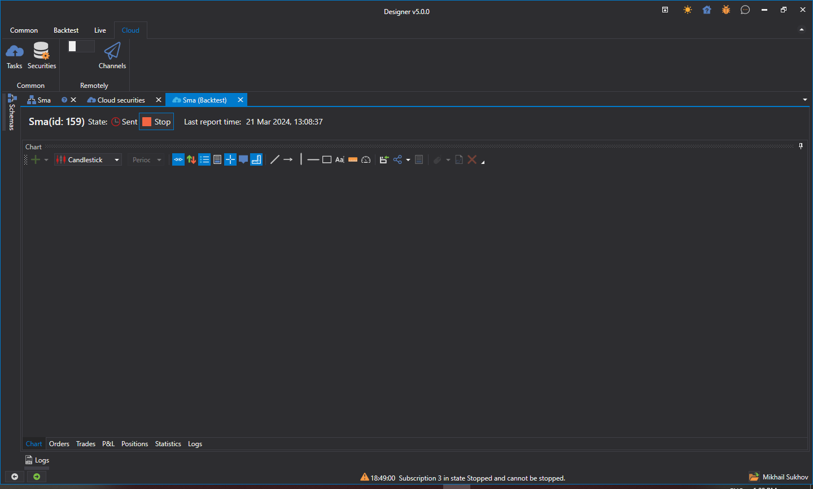
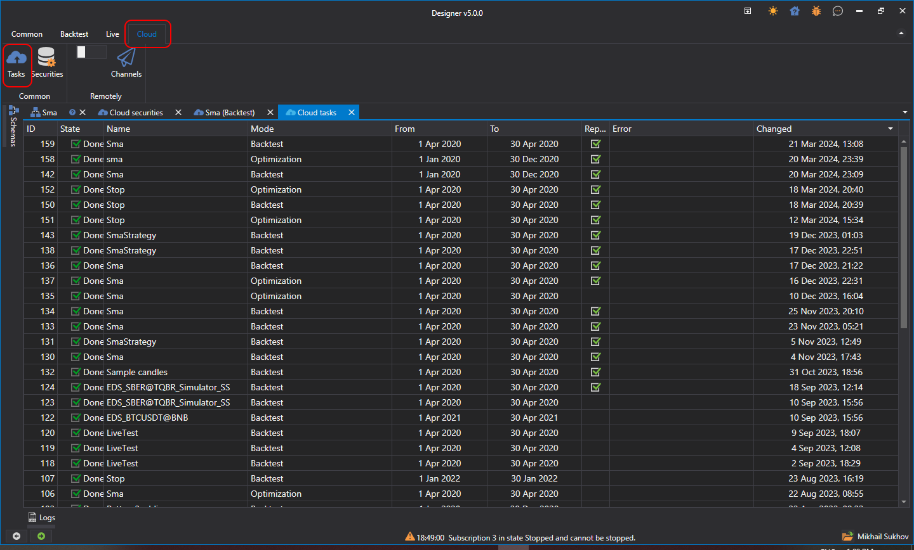

# 云端测试

要在云端测试策略，首先需要找到所有相关交易品种。为此，请在 **Designer** 中打开 **Cloud** 选项卡内用于测试的交易品种搜索面板：

在搜索字段中输入交易品种名称，然后单击 **Search**（或按 **Enter**），StockSharp 服务器会返回符合条件的搜索结果。交易品种名称右侧还会显示可用历史数据的日期范围。

对于每个新交易品种，此操作只需执行一次。找到的交易品种随后会保存在本地磁盘中；重新启动 **Designer** 后，程序会直接从本地存储加载这些交易品种。此步骤是必需的，因为启动策略时需要指定交易品种；在 [Variable](../strategies/using_visual_designer/elements/data_sources/variable.md) 块中直接指定交易品种时同样如此。

接下来返回策略，并在 **Backtest** 选项卡中启用云端选项：

启动测试后，策略不会在本地执行测试，而是发送到 StockSharp 云端：

测试完成后，结果报告会显示在任务等待选项卡中：

要查看云端测试历史记录和当前正在执行的任务，请打开 **Cloud** 选项卡中的 **Tasks** 面板：

