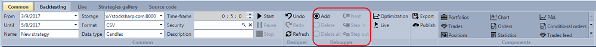

# 调试

测试策略时，经常需要检查某个模块接收到的输入数据，或从其输出端传出的数据。为此，[Designer](../../designer.md) 提供了 **调试器**。

**模拟** 功能区的 **调试器** 组中包含以下按钮：

- **添加断点** – 为选中的元素添加断点。已添加断点的元素会以红色边框突出显示。
- **删除断点** – 删除断点。
- **下一个元素** – 触发断点后，移动到策略图中的下一个元素。
- **单步到输出** – 触发断点后，移动到当前元素的输出端，用于检查从该元素输出的值。
- **单步进入** – 触发断点后，进入复合元素内部。程序会自动打开复合元素的策略图，并在最先接收到数据的元素处停止。
- **单步跳出** – 在复合元素内部触发断点后，退出到包含当前复合元素的上一级。
- **继续** – 继续执行，直到触发下一个断点。

## 推荐内容

[断点](debugging/break_points.md)
