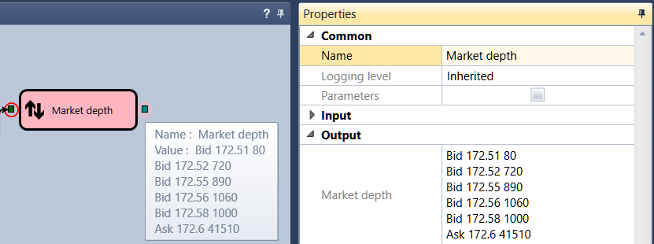

# 断点

要添加断点，请选择模块，然后单击 **Add Breakpoint** 按钮。添加断点后，模块会以红色圆圈标记：

某个元素上的断点触发时，该元素的背景会变为浅红色。
属性窗口会自动选中此元素，并显示其属性以及输入和输出参数的值。
将鼠标指针悬停在输入或输出参数上时，会显示包含参数值的提示。
下图展示了策略执行期间查看复合元素输入值和输出值的示例：

既可以在启动测试前添加断点，也可以在使用历史数据测试策略的过程中添加断点。

单击 **Breakpoints** 按钮后，会打开显示全部断点的窗口。可以为每个断点设置附加触发条件。例如，可以要求逻辑信号值为 **True**。在这种情况下，仅当信号值为 **True** 时，断点才会中止执行。

## 推荐内容

[逐步执行](step_by_step_execution.md)
