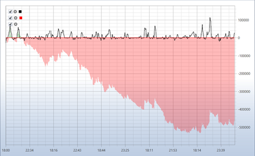

# 入门

下面以 SMA 策略为例。

要使用历史数据运行测试，请先选择需要回测的策略图。在策略文件夹的 [Schemas](../user_interface/schemas.md) 面板中，双击所需策略即可将其选中。

测试前必须加载市场数据，包括证券、蜡烛、逐笔成交和/或订单簿。具体方法请参阅[市场数据存储](../market_data_storage.md)。

切换到策略选项卡时，**Ribbon** 中会自动打开 **Emulation** 选项卡。请在此选项卡中设置测试时间段。在市场数据字段中指定所需存储（参阅[市场数据存储](../market_data_storage.md)），并在证券字段中指定所需证券。

SMA 策略示例使用以下参数：

1. 证券 AAPL@NASDAQ
2. 标准存储 \\Documents\\StockSharp\\Designer\\Storage
3. 存储格式 \- CSV
4. 从存储中读取的数据类型 \- Ticks
5. 订单簿 \- 生成
6. 订单簿深度 \- 5
7. 价差大小 \- 2
8. 时间周期为 30 秒的蜡烛
9. 成交量 \- 100

按上述值设置参数：

设置完所有必需参数后，单击  按钮启动策略测试。

测试期间或测试完成后，可以查看包含测试信息的图表和表格。

图表表明，成交按照策略设计发生在移动平均线的交叉点。还可以看到，订单由多笔成交完成。这是因为测试使用了生成的订单簿，使测试过程更接近真实交易。通过 Trades 表、Statistics 以及 Positions 图表，可以确认订单由多笔成交完成。

从 **Positions chart** 可以看出，策略实际操作的数量有所减少。这是因为生成的订单簿深度为 5，整个订单簿中的可用数量不足以成交 200 手订单。由于该策略只进行持仓反转，因此每当订单簿深度不足以完全成交订单时，后续订单数量都会相应减少。

**P\/L** 图表表明，在这些参数下该策略处于亏损状态。

## 推荐内容

[实盘运行](../live_execution/getting_started.md)
