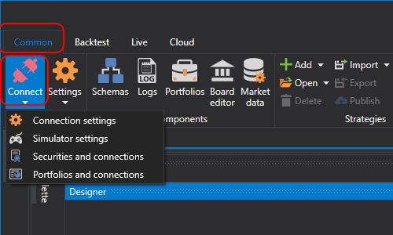
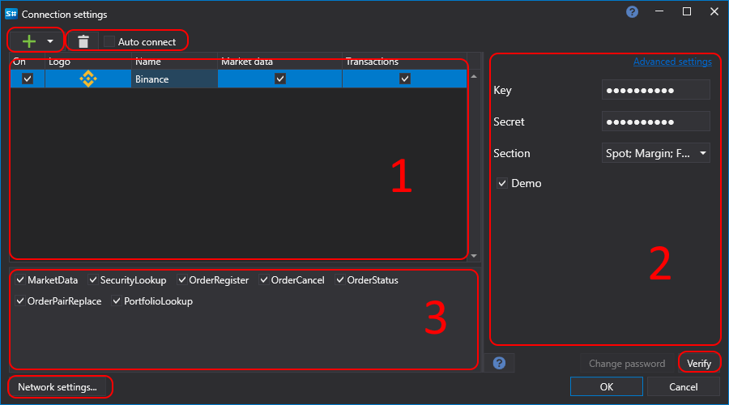

# 连接设置

1. 单击 **连接**  按钮旁的箭头，会显示 **连接设置** 按钮：

2. 单击 **连接设置** 按钮，会打开分为三个区域的 **连接设置** 窗口：

3. 单击  按钮，会打开受支持连接器的下拉列表。所选连接器显示在区域 1 中。单击  按钮可删除选中的连接器。区域 1 的第一列显示单击 **连接**  按钮时，该连接器是会连接，还是不会连接 。使用  和  按钮设置这些值。

**市场数据** 和 **交易** 字段显示连接器是否支持市场数据和订单操作。

4. 选中 **自动连接** 复选框后，[Designer](../designer.md) 启动时会自动建立连接。

5. 区域 2 显示所选连接器的设置。单击  后，程序会打开相关文档（[API](../api.md)），其中介绍如何配置所选连接器。

  > [!IMPORTANT]
  > **高级设置** 仅用于特殊情况，不建议修改。

6. 单击 **检查** 按钮可检查当前连接器的连接。如果检查失败，会显示错误窗口并说明连接失败的原因；如果检查成功，则会显示以下窗口：

7. 区域 3 显示连接器将接收或传输的数据类型。单击 \/  复选框，可以为相应数据类型启用或禁用发送或接收。

8. 单击 **网络设置** 按钮会打开 **代理服务器设置** 窗口：

## 推荐内容

[策略仪表板](live_execution/strategies_dashboard.md)
