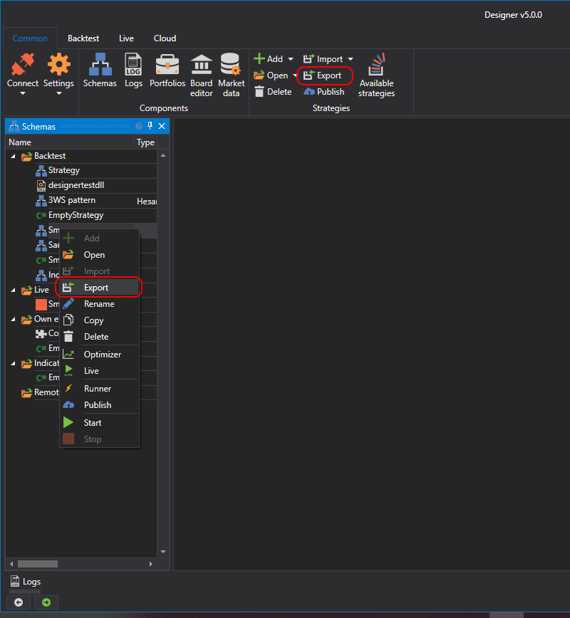
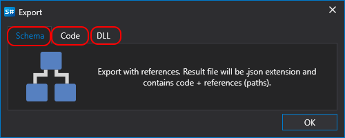

# 导出

Designer 支持导出任意类型的数据，包括策略、模块和指标。可以通过以下方式导出：

- 在 **Schemes** 面板中右键单击策略、模块或指标，然后在显示的菜单中选择 **Export**。
- 在 **Common** 选项卡中单击 **Export** 按钮：

单击 **Export** 后，会根据内容类型显示相应窗口：

- 对于[策略图](../strategies/using_visual_designer.md)：

  

  - scheme - 原样导出策略图。如果策略图使用自定义元素或指标，则需要启用 **Standalone** 模式。此时，所有内部元素都会随策略图一同导出。
  - code - 将策略图转换为 C# 代码。
  - DLL - 将策略图编译为 DLL。适用于需要对代码保密的情况。

- 对于[代码](../strategies/using_code.md)：

  

  - scheme - 将代码导出为 JSON 文件，其中包含代码本身以及编译该代码所需的引用。
  - code - 原样导出代码。
  - DLL - 将代码编译为 DLL。适用于需要对代码保密的情况。

- 对于 [dll](../strategies/using_dll.md)，会显示文件选择窗口。

## 另请参阅

[在 Designer 外部运行策略](../live_execution/running_strategies_outside_of_designer.md)
