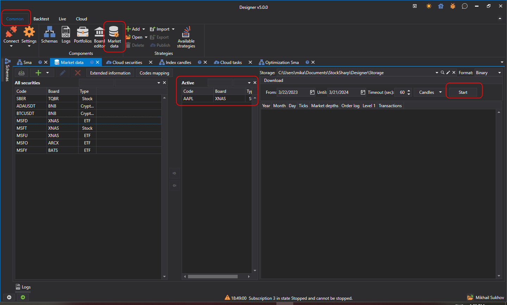

# 市场数据存储

历史数据存储用于从不同数据源加载市场数据（交易品种、K线、逐笔成交和订单簿），并将其保存到本地或远程存储中。[Designer](../designer.md) 既可以使用历史数据源，也可以使用实时数据源（参阅[连接器](../api/connectors.md)）。保存的数据随后可供交易策略使用。

要打开 **市场数据** 选项卡，请切换到 **常规** 选项卡，然后单击 **市场数据** 按钮。**市场数据** 区域分为三个部分。左侧区域列出曾经连接过的所有数据源所提供的全部交易品种。中间区域包含当前使用的交易品种，可用于下载历史数据或查看已下载的数据。右侧区域显示中间区域所选交易品种的可用数据，也可以在此为选中的交易品种下载数据。

## 推荐内容

[入门](market_data_storage/getting_started.md)
