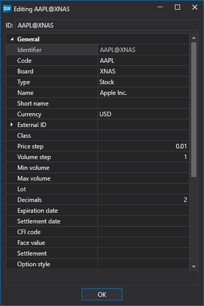

# 创建交易品种

单击 **创建交易品种**  按钮会打开 **编辑** 窗口。要创建交易品种，请填写交易品种属性，然后单击 **确定** 按钮：

来自不同数据源的交易品种使用统一标识符。这样，交易机器人代码便不会依赖连接类型（参阅[连接器](../../api/connectors.md)）。交易品种标识符采用以下格式：**\[交易品种代码\]@\[交易板块代码\]**。例如，NASDAQ 交易所的 Apple 股票标识符为 **AAPL@NASDAQ**。

## 推荐内容

[编辑交易品种](edit_instrument.md)
