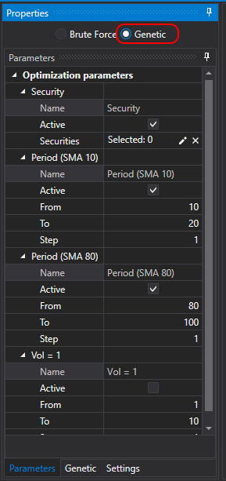

# 遗传算法

**Designer** 既支持[穷举优化](brute_force.md)，也支持基于遗传算法的优化。遗传算法优化可以显著加快寻找最优参数的过程。

要启用 **Genetic** 优化，请执行以下操作：

- 切换优化模式：

  

- 设置优化参数：

  

- 可以为目标函数（Fitness）指定扩展公式：

  

  例如，不仅根据 **Profit** 计算适应度，还可以将其与 **Maximum Drawdown** 结合计算。可用的数学函数与 [Formula](../strategies/using_visual_designer/elements/common/formula.md) 模块类似。

> [!TIP]
> 遗传算法优化具有非确定性。因此，与[穷举搜索](brute_force.md)不同，无法预先确定准确的迭代次数，也无法准确估算所需总时间。
