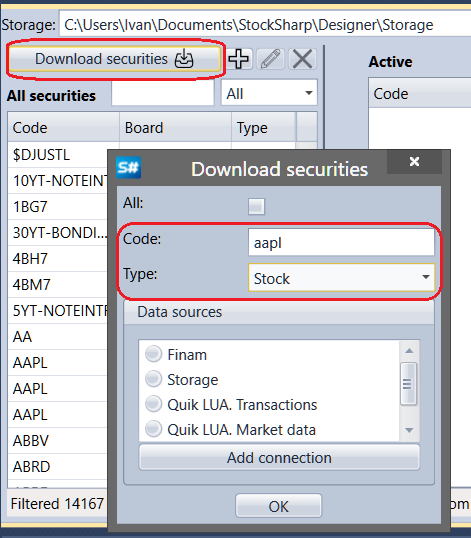
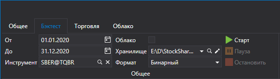

# 快速入门

首次启动时，[Designer](../designer.md) 会打开预先配置好的移动平均线策略图表。

要在历史数据上运行该策略，需要先下载正确格式的数据。建议使用 [Hydra](../hydra.md)：这是一个用于从不同数据源自动加载市场数据（交易品种、K线、逐笔成交、订单簿以及其他数据）并保存到本地存储的程序。历史数据下载和存储在[市场数据存储](market_data_storage.md)中有详细说明。

通过 [Hydra](../hydra.md) 下载数据后，需要在 [Designer](../designer.md) 中指定 [Hydra](../hydra.md) 保存历史数据的目录。该目录在 **Backtest** -> **Storage** 选项卡中配置。

单击  会打开 **Data storage settings** 窗口，可在其中配置本地或远程存储。也可以将 [Hydra](../hydra.md) [服务器模式](../hydra/server_mode/settings.md)配置为市场数据源。单击 ![[Designer_Settings_Repository_button.png]] 会打开文件夹选择窗口。请选择之前由 [Hydra](../hydra.md) 下载并保存历史数据的文件夹。

如果没有所需的交易品种，请手动下载它们。

市场数据管理选项卡会打开。要获取可用交易品种，请单击[下载交易品种](market_data_storage/download_instruments.md)。要下载交易品种，请输入其代码，或选择 **All** 标志，选择数据源，然后单击 **OK**。[Designer](../designer.md) 会从数据源请求可用交易品种。所有找到的交易品种都会显示在 **All instruments** 面板中。

现在 [Designer](../designer.md) 可以使用存储中已有的已下载交易品种和历史数据。请选择一个演示策略。在 [Schemas](user_interface/schemas.md) 面板中打开 **Strategies** 文件夹，并双击 **SMA** 示例策略。工作区中会出现 **Sma** 选项卡。切换到策略后，功能区会自动打开 **Backtest** 选项卡，其中包含创建、调试和测试策略的主要控件（[创建策略](strategies/using_visual_designer.md)、[历史测试示例](backtesting/getting_started.md)）。

在 **Backtest** 选项卡中设置测试时间段，选择交易品种，并选择[市场数据存储](market_data_storage.md)。

单击 **Instrument** 字段中的  会打开 **Select instrument** 窗口。请在此窗口中选择所需的交易品种。

在 **Designer** 面板中选择任意模块后，**Properties** 面板会显示该模块的属性。在 **Candles** 模块的 **Properties** 面板中，可以配置 K线类型和 Time Frame（[K线](../api/candles.md)）。

单击 **Start** 按钮后，交易仿真开始运行。

