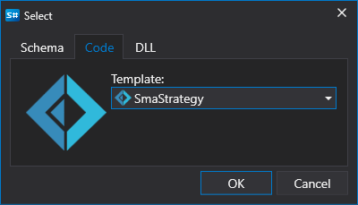
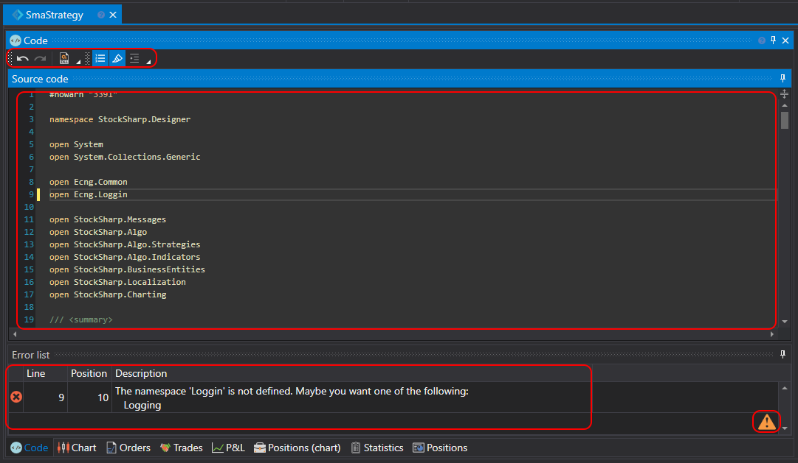

# 使用 F#

通过代码创建策略适合偏好 F# 编程的用户。与策略图相比，此类策略不受功能限制，可以实现任意算法。

可以直接在 [Designer](../../../designer.md) 中创建策略，也可以使用 **F#** 开发环境（最常用的是 **Visual Studio** 和 **JetBrains Rider**），结合专业的 **F#** 交易机器人开发库和 [API](../../../api.md) 进行开发。

要添加新策略，可以在 **Common** 选项卡中单击 **Add**  按钮，然后选择 **Strategy**。也可以在 **Scheme** 面板中右键单击 **Strategies** 文件夹，再在下拉菜单中单击 **Add**  按钮：

单击 **Add**  按钮后，会显示用于选择策略内容类型的窗口：

要通过 F# 代码创建策略，请选择第二个选项卡。还可以选择一个模板作为初始代码。

单击 **OK** 后，新策略会显示在 **Scheme** 面板的 **Strategies** 文件夹中，与通过[策略图](../using_visual_designer.md)创建策略时相同。删除和重命名策略的操作也相同。

但此时显示的不是策略图，而是 F# 代码编辑器：

代码编辑器选项卡由 **Source Code** 和 **Error List** 面板组成。**Source Code** 面板包含 F# 代码编辑器。顶部工具栏可用于启用或禁用 **Current Line**、**Line Number** 等显示选项。可以使用 CTRL+鼠标滚轮放大或缩小字体。

**Error List** 面板以表格形式显示代码错误。双击某一行后，**Source Code** 面板中的光标会自动移动到对应的错误位置。

编辑代码时，**Error List** 面板右下角会显示  图标，表示程序已开始跟踪更改。代码停止变化后会自动编译。

策略的[回测](../../backtesting/user_interface.md)、[实盘运行](../../live_execution/getting_started.md)及其他操作，与使用策略图创建的策略相同。
