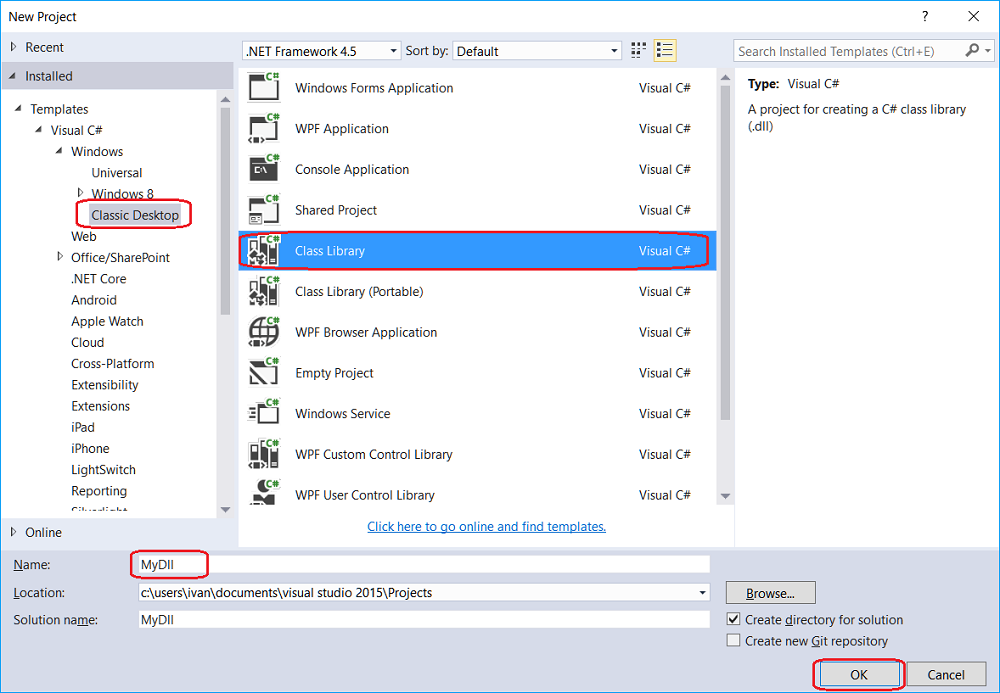
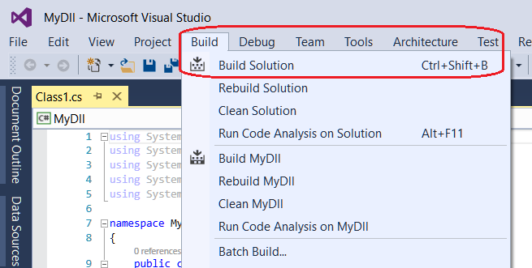

# 使用 DLL

使用现成 DLL 的方式适合希望始终在 **Visual Studio** 或 **JetBrains Rider** 中开发的用户。与直接在 **Designer** 内编写[代码](using_code.md)相比，这种方式具有以下优势：

- 可以使用比 **Designer** 内置编辑器更强大的代码编辑器。
- 重新编译代码后，**Designer** 中的内容会自动更新。
- 可以将代码拆分到多个文件中；使用[代码](using_code.md)方式时，只支持 OneFile-OneStrategy 模式。
- 可以使用[调试器](using_dll/debug_dll_in_visual_studio.md)。

### 在 Visual Studio 中创建项目

1. 要在 **Visual Studio** 中创建策略，请先创建项目：

2. 然后编写策略代码。要快速开始，可以复制[代码策略](using_code/csharp/first_strategy.md)模板中的 SmaStrategy 代码：

3. 要编译代码，需要添加 NuGet 包 [StockSharp.Algo](https://www.nuget.org/packages/stocksharp.algo)，所有策略的基类 [Strategy](xref:StockSharp.Algo.Strategies.Strategy) 都位于该包中：

如果策略使用图表接口，还需要添加 NuGet 包 [StockSharp.Charting.Interfaces](https://www.nuget.org/packages/stockSharp.charting.interfaces)。这些接口不包含实际的图表逻辑，仅用于编译代码。在 **Designer** 中启动策略时，真实数据会通过这些接口绘制到图表上。

4. 创建策略后，请在 **Build** 选项卡中单击 **Build Solution** 构建项目。

5. 默认情况下，Visual Studio 会将项目构建到 …\\bin\\Debug\\net6.0 文件夹。

### 将 DLL 添加到 Designer

1. 从 DLL 添加策略的过程与通过[代码](using_code.md)创建策略类似，但在选择内容类型时需要选择 **DLL**：

2. 在窗口中指定程序集路径（程序集必须兼容 .NET 6.0），然后选择类型。之所以需要选择类型，是因为一个 DLL 中可以包含多个策略，也可以包含[模块和指标](using_dll/create_element_and_indicator.md)。单击 **OK** 后，策略会添加到 **Scheme** 面板并可立即使用：

3. 策略的[回测](../backtesting/user_interface.md)、[实盘运行](../live_execution/getting_started.md)及其他操作，与使用策略图或代码创建的策略相同：

