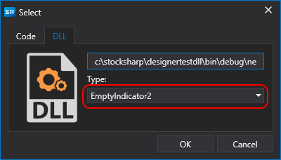

# 创建模块和指标

从 DLL 程序集创建模块或指标的流程与通过代码创建的流程类似（参阅创建[模块](../using_code/csharp/creating_your_own_cube.md)和[指标](../using_code/csharp/create_own_indicator.md)），区别仅在于选择内容的阶段。与添加 [DLL 策略](../using_dll.md)时相同，如果连接的 DLL 中包含模块或指标，则可以选择对应的模块类型或指标类型：

创建指标时，需要添加 NuGet 包 [StockSharp.Algo](https://www.nuget.org/packages/stocksharp.algo) 才能编译代码。所有指标的基类 [BaseIndicator](xref:StockSharp.Algo.Indicators.BaseIndicator) 位于该包中。

创建模块时，需要添加 NuGet 包 [StockSharp.Diagram.Core](https://www.nuget.org/packages/stockSharp.diagram.core) 才能编译代码。所有模块的基类 [DiagramExternalElement](xref:StockSharp.Diagram.DiagramExternalElement) 位于该包中。

将连接的模块或指标添加到策略图时，请按照[模块](../using_code/csharp/creating_your_own_cube.md)或[指标](../using_code/csharp/create_own_indicator.md)章节中的步骤操作。

## 另请参阅

[使用 Visual Studio 调试 DLL 模块](debug_dll_in_visual_studio.md)
