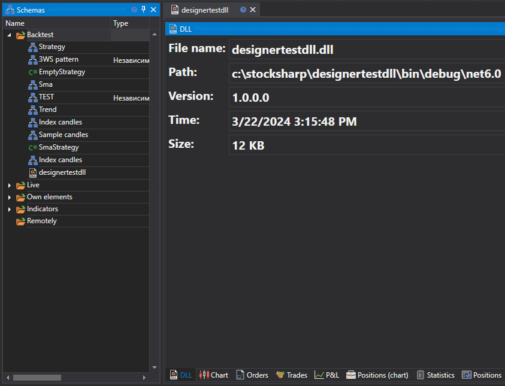

# 使用 Visual Studio 调试 DLL

Visual Studio 支持使用调试器附加到正在运行的进程。有关该功能的详细说明，请参阅 Visual Studio 文档[附加到正在运行的进程](https://learn.microsoft.com/en-us/visualstudio/debugger/attach-to-running-processes-with-the-visual-studio-debugger?view=vs-2022)。下面使用[使用 DLL](../using_dll.md)章节中添加的策略演示调试过程。

1. 要附加到进程并开始调试 DLL 策略，必须先将该 DLL 加载到内存中。[添加策略](../using_dll.md)后，DLL 会被加载到内存，此时即可附加到进程。

2. 在 Visual Studio 中选择 **Debug -> Attach to Process**。

3. 在 **Attach to Process** 对话框的 **Available processes** 列表中，找到需要附加的 **Designer.exe** 进程。

如果该进程由其他用户账户运行，请选中 **Show processes from all users** 复选框。

4. 必须确保 **Attach to** 字段指定了正确的待调试代码类型。默认的 **Auto** 参数会尝试自动判断代码类型，但判断结果并不总是正确。要手动设置代码类型，请执行以下步骤：

- 在 Attach to 字段中单击 **Select**。
- 在 **Select Code Type** 对话框中选择 **Debug these code types**，然后选择需要调试的类型。
- 单击 OK。

5. 单击 Attach 按钮。

6. 在 Visual Studio 代码中设置断点。如果 Studio 已进入调试模式，且断点显示为红色实心图标 ，表示已加载正确版本的 DLL。如果断点显示为红色空心图标 ，则表示加载了错误版本的 DLL。

7. 本例在 **public void ProcessCandle(Candle candle)** 方法的第一行设置断点。当策略在 [Designer](../../../designer.md) 中运行，并开始向 DLL 传递K线值时，Visual Studio 会在断点处停止。此后即可跟踪代码执行过程：

> [!WARNING]
> 代码在调试器中暂停时，**Designer** 内部的所有进程也会暂停。如果程序连接到真实交易环境，长时间停留在断点处可能导致连接中断。

## 另请参阅

[导出策略](../../export_import/export.md)
