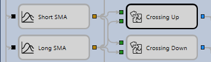

# 复合元素

构建策略图时，经常会出现能够实现完整功能的元素组合。这些组合可以用于不同策略图，也可以在同一策略图中使用不同属性值重复调用。可以将此类组合提取为独立的复合元素，之后像普通模块一样使用。

复合元素本质上也是普通策略图，可以像其他策略图一样保存、加载和编辑。

将复合元素添加到策略图时，系统会自动把所有内部模块中未连接的参数添加到复合元素。模块输入端未连接的参数会成为输入参数，输出端未连接的参数会成为输出参数。每个新增参数都使用源元素及其参数的名称。此外，所有启用了 **参数** 属性的元素，其属性也会添加到复合元素中。

下面以移动平均线交叉策略为例介绍复合元素的使用。该策略多次使用[交叉](elements/common/crossing.md)复合元素：短期移动平均线自下向上穿越长期移动平均线时开多仓，自上向下穿越时开空仓。用于确定移动平均线交叉时刻的策略图如下：

移动平均线交叉仅在方向上有所不同（短期均线从上向下或从下向上穿越），因此可以将判断交叉时刻的部分提取为单独的复合元素。把该元素添加到策略图后，需要指定定义移动平均线交叉算法的属性。用于判断交叉的复合元素策略图如下：

该复合元素由若干简单元素组成。其逻辑是保存当前值（Prev In 1 和 Prev In 2），并比较当前值对（CurrComparison）与上一组值（PrevComparison）。由于每个输入值都由策略图中的两个元素使用，因此在复合元素输入端放置了[组合](elements/common/combination.md)元素（In 1、In 2），将一个输入分配给两个元素，并把输入值传递给[比较](elements/common/comparison.md)和[上一值](elements/common/prev_value.md)元素。新值到达输入端后，系统先比较当前值，再把新值传给[上一值](elements/common/prev_value.md)元素，由该元素输出当前输入的上一值，随后比较上一组值。如果两个条件均满足（通过 And [逻辑条件](elements/common/logical_condition.md)检查），则将已置位标志传递到复合元素输出端，作为后续操作的触发器。

CurrComparison 和 PrevComparison 模块在 **常规** 属性组中启用了 **参数** 标志。因此，这些模块的属性会暴露为[交叉](elements/common/crossing.md)复合元素的属性，在策略图中使用该复合元素时可以进一步设置。

## 推荐内容

[在图表上显示K线](schema_samples/display_candles_on_chart.md)
