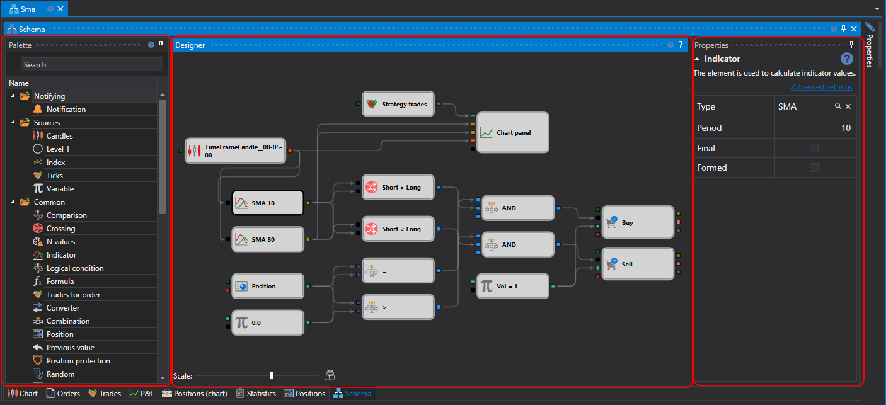

# 策略设计器

策略及其组成元素的主要设计工作在 **策略图** 面板中完成，用户通过组合模块和连接线构建策略。策略图面板由 **元素面板**、**设计器** 和 **属性** 三个面板组成。

## Palette 面板

**元素面板** 面板包含用于创建策略的模块。面板中的全部元素按类别划分，详见[模块说明](elements.md)。要将模块添加到 **Designer** 面板，请在所需模块上按住鼠标右键，将其拖动到 **Designer** 面板后松开。随后程序会自动选中该元素，并在属性编辑窗口中显示模块参数。

## Designer 面板

**Designer** 面板用于通过组合模块和连接线完成整个策略创建过程，并直观显示策略图。有关创建策略的详细说明，请参阅[通过模块创建算法](first_strategy.md)。

## 属性面板

**属性** 面板显示 **Designer** 面板中当前选中模块的参数。模块被选中时，其边框会显示为黑色。

**属性** 面板支持两种显示模式：*Basic settings* 和 *Advanced settings*。

默认情况下，构建策略图时首先以 *Basic settings* 模式显示属性。要切换到 *Advanced settings* 模式，请单击相应标题。

*Basic settings* 模式仅显示模块最常用的属性。例如，对于[K线](elements/data_sources/candles.md)模块，会显示时间周期、是否仅接收已形成K线、是否允许根据更小时间周期构建K线，以及是否根据信号订阅K线等选项。

*Advanced settings* 模式会显示该模块所有可修改和配置的属性。

所有模块都包含一组预定义属性，这些属性会在 *Advanced settings* 模式中显示：

- **名称** – 元素名称，显示在设计器中。
- **日志级别** – 该元素的日志级别。
- **参数** – 在更高层级的元素中显示该元素的参数。
- **端口** – 在更高层级的元素中显示该元素的端口。

有关各模块属性的详细说明，请参阅[模块说明](elements.md)。

## 另请参阅

[模块说明](elements.md)
