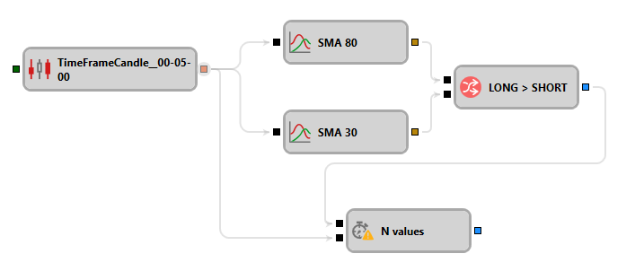

# 值延迟

该组件用于将值的传递延迟指定的迭代次数。

## 输入端口

- **Trigger** – 用于初始化内部计数器并开始延迟倒计时的信号（除 `False` 以外的任意值）。
- **Input** - 任意传入值（[未完成的K线](../data_sources/candles.md)和[非最终指标值](indicator.md)除外）。每收到一个值，内部计数器就会递减。当计数器减至零时，计数器停用并激活输出端口。如果计数器尚未由 **Trigger** 激活，则会忽略传入值。

## 输出端口

- **Signal** – 当计数器减至零时输出信号，表示延迟结束。

## 参数

- **Duration** - 以迭代次数指定延迟时长。

## 另请参阅

- [比较](comparison.md)
