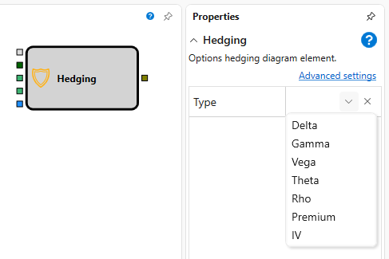

# 对冲

该模块用于对冲期权持仓。

### 输入端口

输入端口

- **模型** – 计算模型（例如 Black-Scholes）。
- **交易品种** – 作为标的资产的交易品种。
- **数量** \- 成交量的数值。
- **按标的资产持仓** – 标的资产的持仓。
- **标志** – 启动对冲过程的信号（标志）。

### 输出端口

输出端口

- **订单** – 已注册的订单。可以使用 **按订单成交** 元素获取该订单的成交，并通过 **图表面板** 模块将其显示在图表上。

### 参数

参数

- **对冲类型** \- 对冲类型，可取 Delta、Gamma、Vega、Theta 或 Rho。

## 推荐内容

[期权做市](options_quoting.md)
