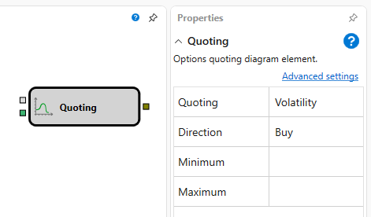

# 期权做市

该模块用于按照指定参数对期权进行报价。

### 输入端口

输入端口

- **Model** – 计算模型（例如 Black-Scholes）。
- **Volume** \- 报价数量。

### 输出端口

输出端口

- **Order** \- 已注册的订单。可以使用按订单筛选的 **Trades** 元素获取该订单的成交，并通过 **Chart panel** 模块将其显示在图表上。

### 参数

参数

- **Quoting** \- 用于执行报价的参数。可取 **Volatility**（报价数量将遵循指定的波动率限制）或 **Theoretical price**（报价数量将遵循指定的理论价格限制）。
- **Direction** \- 报价方向，可取 Purchase 或 Sell。
- **Minimum** – 波动率或理论价格的最小值。
- **Maximum** \- 波动率或理论价格的最大值。

## 推荐内容

[Derivatives](strikes.md)
