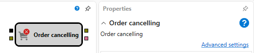

# 撤销订单

该模块用于撤销交易品种的订单。

### 输入端口

输入端口

- **Trigger** – 触发订单撤销的事件。
- **Order** – 用于确定何时需要撤销订单的信号。

### 输出端口

输出端口

- **Order** – 已撤销的订单。可以使用 **Transactions** 元素获取该订单的成交，也可以使用 **Chart Panel** 模块将其显示在图表上。
- **Error** – 撤销订单时发生的错误（例如订单此前已经成交或撤销）。

## 另请参阅

[批量撤销订单](mass_cancel.md)
