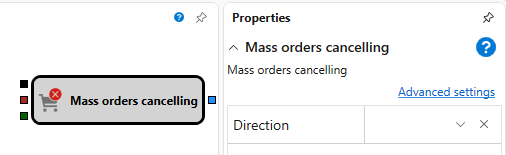

# 批量撤销订单

该模块用于撤销指定交易品种的全部订单。

### 输入端口

输入端口

- **触发器** - 用于确定何时撤销订单的信号。
- **投资组合** – 要撤销其全部订单的投资组合。
- **交易品种** – 要撤销其全部订单的交易品种。

### 输出端口

输出端口

- **结果** - 表示操作成功的标志。

### 参数

参数

- **方向** – 要撤销订单的方向（买入或卖出），作为订单的撤销条件。

## 另请参阅

[注册订单](register.md)
