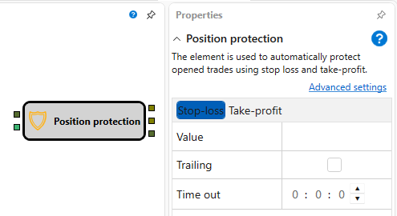
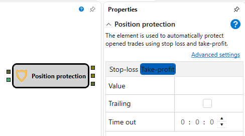

# 持仓保护

该模块使用止损和止盈自动保护已开仓的成交。

### 输入端口

输入端口

- **自有成交** – 需要通过止损和止盈进行保护的成交。
- **价格** – 当前价格（可取自K线、最近一笔逐笔成交等）。该值用于跟踪交易品种的当前价格并激活保护订单。

### 输出端口

输出端口

- **止盈** – 用于锁定利润的订单。
- **止损** – 用于限制损失的订单。
- **自有交易事务** – 由上述任一订单产生的成交。

### 参数

止盈和止损参数

- **值** - 止盈或止损的数值。
- **跟踪** – 是否使用跟踪保护。
- **超时** - 超时时长，超过该时间后将按市价强制触发保护。
- **市价单** – 使用不指定价格的市价订单快速平仓。

> [!WARNING]
> 传入成交不能是整个策略的成交（即[策略成交](../common/trades_by_strategy.md)模块的输出），否则会导致当前持仓计算错误：保护订单产生的成交也会成为策略成交。**持仓保护** 模块应接收 [注册订单](../orders/register.md) 和 [修改持仓](modify.md) 模块的 **交易事务** 输出端口所产生的成交，或接收来自其他直接改变持仓的类似组件的成交。
