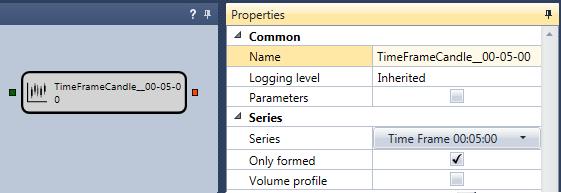
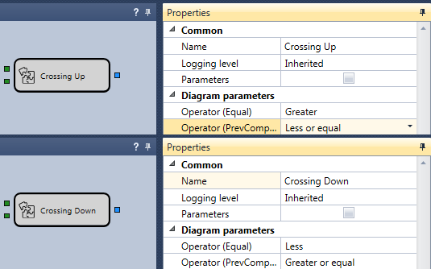

# 第一个策略

要创建策略图和复合元素，并使用历史数据测试所得到的策略，可以参考移动平均线（SMA）策略示例。通过该示例，可以完成从策略创建到测试和调试的整个流程。移动平均线（SMA）策略位于 **Schemas** 面板的 **Strategies** 文件夹中。

1. 按照 [Using Code](../using_code.md) 中的说明，使用模块创建新策略。可以在 **Common** 选项卡中单击 **Add**  按钮，然后选择 **Strategy**。也可以在 **Schemas** 面板中右键单击 **Strategy** 文件夹，再在下拉菜单中单击 **Add**  按钮。

在 **Schemas** 面板的 **Strategy** 文件夹中单击 **Add**  按钮后，会出现一个新策略。工作区中会打开一个新的策略选项卡，切换到该选项卡时，功能区会自动打开 **Emulation** 选项卡。在 **Emulation** 选项卡中，可以修改策略名称并添加简短说明。

2. 为便于操作，需要单击  按钮，打开并固定 **Schemas** 区域的 **Palette** 和 **Properties** 面板。完成后的窗口如下所示。

3. 移动平均线（SMA）策略的基本原理如下：

- 使用两个计算周期不同的移动平均线：长期 SMA 和短期 SMA。在本示例中，长期 SMA 的 [Indicator](elements/common/indicator.md) 模块名为 Long SMA，周期为 80 根K线；短期 SMA 模块名为 Short SMA，周期为 10 根K线。
- 当短期移动平均线从下向上穿过长期移动平均线时，建立多头持仓。
- 当短期移动平均线从上向下穿过长期移动平均线时，建立空头持仓。
- 收到开仓信号时，如果当前存在相反方向的持仓，则反转持仓。

4. 所有策略都需要用于成交的交易品种和投资组合。应从 **Palette** 面板将它们添加到 **Designer** 面板。本示例中，类型为 **Instrument** 的 [Variable](elements/data_sources/variable.md) 模块命名为 Instrument，类型为 **Portfolio** 的 [Variable](elements/data_sources/variable.md) 模块命名为 Portfolio。选中 Instrument 和 Portfolio 模块的 **Parameters** 复选框。选中后，模块会从策略设置中获取值。如果未选中，则需要手动输入交易品种和投资组合的值。如果将 [Variable](elements/data_sources/variable.md) 模块的 Value 字段留空，同时也未选中 Parameters 复选框，测试策略时会报告 [Variable](elements/data_sources/variable.md) 模块的值未设置。

如果策略需要使用多个交易品种或投资组合，则应为每个模块取消选中 **Parameters** 复选框，并设置相应的交易品种或投资组合值。

5. 添加交易品种和投资组合后，添加两个 [Indicator](elements/common/indicator.md) 模块并选择 SMA 类型。将第一个命名为 Long SMA，周期设置为 80 根K线；将第二个命名为 Short SMA，周期设置为 10 根K线。

6. 指标需要接收K线序列才能工作。为此，需要创建 [Candles](elements/data_sources/candles.md) 模块。本示例仅使用时间周期为 5 分钟的已完成K线。

7. 添加指标后，需要添加两个用于判断指标交叉的模块，即复合元素中的 [Crossing](elements/common/crossing.md) 模块。第一个模块命名为 Crossing Up，用于判断自下而上的交叉。将 Short SMA 指标传入模块的上方输入端，将 Long SMA 指标传入下方输入端。将 CurrComparison 运算符设置为“大于”，将 PrevComparison 运算符设置为“小于或等于”。第二个模块命名为 Crossing Down，用于判断自上而下的交叉。将 Short SMA 指标传入模块的上方输入端，将 Long SMA 指标传入下方输入端。将 CurrComparison 运算符设置为“小于”，将 PrevComparison 运算符设置为“大于或等于”。

8. 为了直观显示K线、指标和成交，应添加 [Chart](elements/common/chart.md)。在 [Chart](elements/common/chart.md) 中添加K线、两个指标和成交等显示元素。

9. 使用策略的 **Trades** 模块作为图表中成交数据的来源。本示例将其命名为 Strategy trades。

10. 添加两个 [Register order](elements/orders/register.md) 模块来建立持仓。第一个模块用于通过市价订单买入，其输入端接收 **Instrument**、来自 Crossing Up 交叉模块的开仓信号、**Portfolio** 和订单数量。第二个模块用于通过市价订单卖出，其输入端接收 **Instrument**、来自 Crossing Down 交叉模块的开仓信号、**Portfolio** 和订单数量。

11. 使用连接线（[Lines](lines.md)）连接上述元素后，就得到了一个尚未考虑策略当前持仓的策略图。在这种情况下，策略可能累积过多手数。

要控制持仓，需要添加 [Position](elements/positions/current.md) 模块，并将 **Instrument** 和 **Portfolio** 传入其输入端。

可以使用 [Get current position](schema_samples/get_current_position.md) 章节中介绍的现成策略图来处理当前持仓。该策略图会计算注册订单时所需的实际数量；如果需要反转持仓，则会给出当前持仓数量的两倍。

12. 最终完成的策略如下所示：

## 推荐内容

[Composite elements](composite_elements.md)
