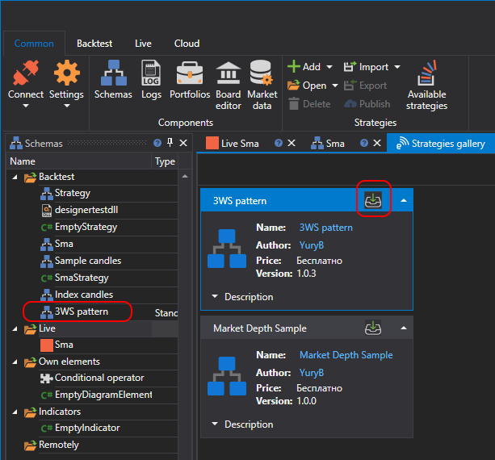

# 策略库

**Strategy Gallery** 可用于将现成的交易策略下载到本地计算机。单击 **Common** 选项卡中的 **Strategy Gallery** 按钮即可将其打开。

要将策略下载到本地计算机：

- 选择所需策略，然后单击 Download 按钮：

  

- 该策略将添加到 **Backtest** 区域的策略树中：

  

## 另请参阅

[发布自己的策略](strategy_gallery/publish_own_strategy.md)
