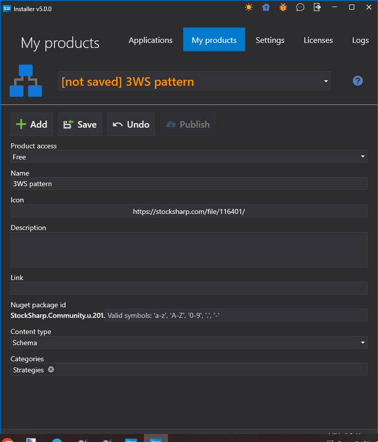
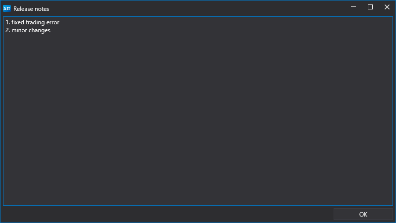

# 发布自己的策略

在[策略图面板](../user_interface/schemas.md)中用鼠标左键单击策略，然后选择 **发布**，即可发布该策略：

单击 **发布** 按钮后，会打开用于选择导出类型的窗口。有关详细信息，请参阅[策略导出](../export_import/export.md)章节。

选择导出类型后，会使用发布参数激活 [安装程序](../../installer.md) 程序（必须提前启动 [安装程序](../../installer.md)）：

必须填写以下字段：

- 名称
- 描述
- NuGet 包标识符。此参数用于设置商店中产品的链接。例如，在地址 https://stocksharp.com/store/runner/ 中，单词 **runner** 由此参数指定。

只有通过电子邮件 [info@stocksharp.com](mailto:info@stocksharp.com) 联系后，才能获得 **免费** 或 **付费** 级别的访问权限。默认提供 **私有** 级别，该级别仅允许以私有形式向选定用户发布策略：

单击 **保存** 按钮后，策略将发送到 StockSharp 服务器。

发布更新时无需再次输入所有参数。系统不会再显示产品参数输入窗口，而是显示用于填写更新说明的窗口：

单击 **确定** 按钮后，会显示更新成功的窗口：

