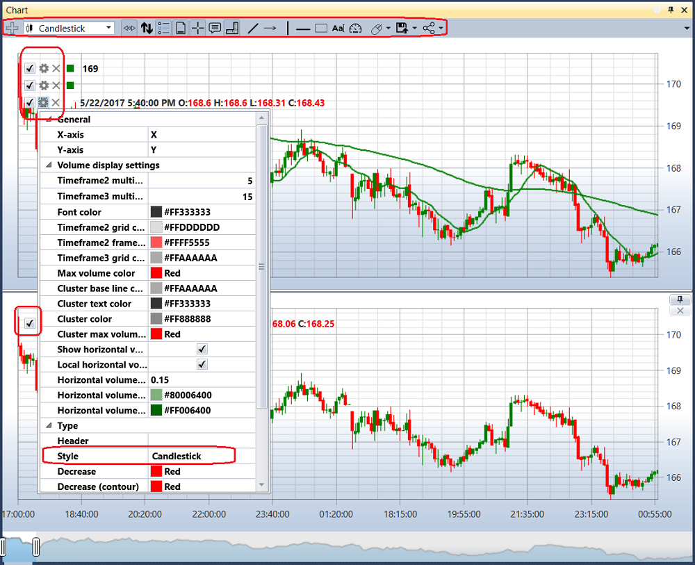
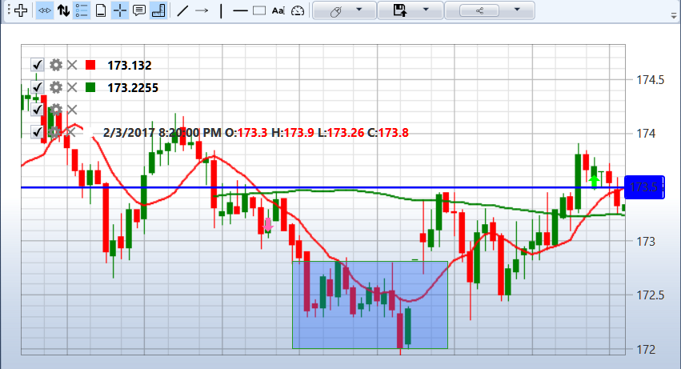

# 图表

**Chart** 组件包含策略中的所有 **Chart panel** 模块。例如，如果策略使用两个 **Chart panel** 模块，则 **Chart** 组件中会显示两个图表，如图所示。

每个图表的左上角会显示添加到图表中的全部图形元素。清除  图形元素旁的复选框后，该元素会从图表中隐藏。单击  按钮可以打开图形元素设置。也可以在 [Chart](../../strategies/using_visual_designer/elements/common/chart.md) 模块的属性中配置图形元素。

在图形元素设置中，可以选择所需的图表样式，例如日本K线、柱状图、箱形图和聚类分布图等。

对于箱形图，还可以对K线进行额外分组。分组顺序通过以下字段设置：第二时间周期倍数和第三时间周期倍数。

图表上方提供工具栏，可以选择自动滚动、自动缩放、图例模式以及其他通用图表设置。还可以选择要在图表上绘制的元素：线、水平位、指针、矩形和文本。

## 推荐内容

[Orders](orders.md)
