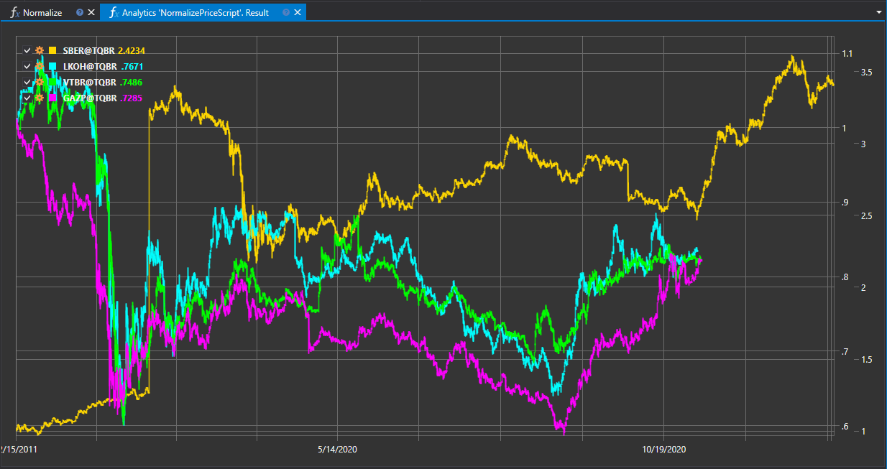

# 收盘价归一化

`Closing Price Normalization` 脚本用于对交易品种的收盘价进行归一化，以便在统一尺度下比较和分析不同资产。这在比较价格水平和波动性各不相同的交易品种时尤其有用。



## 脚本运行说明

脚本根据所选的归一化方法，对收盘价数据进行缩放或转换。处理结果是一组归一化数值，可用于定量比较和多交易品种分析。

## 归一化的应用

- **统一价格尺度**：归一化可将不同交易品种的数据转换到同一尺度，简化直观比较和分析评估。
- **相关性分析**：利用归一化数据可以识别资产之间的相关关系，并构建多元化投资组合。
- **创建指数和模型**：归一化价格可用于创建综合指数、定价模型以及开展其他量化研究。

## 归一化方法

归一化可以采用以下方法：

1. **缩放**：将收盘价调整到指定数值范围，例如 0 到 1。
2. **Z 分数**：使用 Z 分数转换收盘价，以表示某个值与均值相差多少个标准差。
3. **对数化**：应用对数变换，使数据分布更加平滑，并降低极端值的影响。

## 脚本实现

归一化过程通常包括以下步骤：

1. **选择归一化方法**：根据分析目标和数据特征确定归一化方法。
2. **处理数据**：对每个交易品种的收盘价应用所选归一化方法。
3. **分析结果**：使用归一化数据进行后续分析和交易品种比较。

`Closing Price Normalization` 脚本是为交易和量化分析准备数据的重要工具，使交易者和分析人员能够在各种策略与研究中更准确地比较和评估金融资产。

## C# 脚本代码

```cs
namespace StockSharp.Algo.Analytics
{
	/// <summary>
	/// The analytic script, normalize securities close prices and shows on same chart.
	/// </summary>
	public class NormalizePriceScript : IAnalyticsScript
	{
		Task IAnalyticsScript.Run(ILogReceiver logs, IAnalyticsPanel panel, SecurityId[] securities, DateTime from, DateTime to, IStorageRegistry storage, IMarketDataDrive drive, StorageFormats format, DataType dataType, CancellationToken cancellationToken)
		{
			if (securities.Length == 0)
			{
				logs.LogWarning("No instruments.");
				return Task.CompletedTask;
			}

			var chart = panel.CreateChart<DateTimeOffset, decimal>();

			foreach (var security in securities)
			{
				// stop calculation if user cancel script execution
				if (cancellationToken.IsCancellationRequested)
					break;

				var series = new Dictionary<DateTimeOffset, decimal>();

				// get candle storage
				var candleStorage = storage.GetCandleMessageStorage(security, dataType, drive, format);

				decimal? firstClose = null;

				foreach (var candle in candleStorage.Load(from, to))
				{
					firstClose ??= candle.ClosePrice;

					// normalize close prices by dividing on first close
					series[candle.OpenTime] = candle.ClosePrice / firstClose.Value;
				}

				// draw series on chart
				chart.Append(security.ToStringId(), series.Keys, series.Values);
			}

			return Task.CompletedTask;
		}
	}
}

```

## Python 脚本代码

```python
import clr

# Add .NET references
clr.AddReference("StockSharp.Messages")
clr.AddReference("StockSharp.Algo.Analytics")
clr.AddReference("Ecng.Drawing")

from Ecng.Drawing import DrawStyles
from System.Threading.Tasks import Task
from StockSharp.Algo.Analytics import IAnalyticsScript
from storage_extensions import *
from candle_extensions import *
from chart_extensions import *
from indicator_extensions import *

# The analytic script, normalize securities close prices and shows on same chart.
class normalize_price_script(IAnalyticsScript):
	def Run(self, logs, panel, securities, from_date, to_date, storage, drive, format, data_type, cancellation_token):
		if not securities:
			logs.LogWarning("No instruments.")
			return Task.CompletedTask

		chart = create_chart(panel, datetime, float)

		if data_type is None:
			logs.LogWarning(f"Unsupported data type {data_type}.")
			return Task.CompletedTask

		message_type = data_type.MessageType

		for security in securities:
			# stop calculation if user cancel script execution
			if cancellation_token.IsCancellationRequested:
				break

			series = {}

			# get candle storage
			candle_storage = get_candle_storage(storage, security, data_type, drive, format)

			first_close = None

			for candle in load_range(candle_storage, message_type, from_date, to_date):
				if first_close is None:
					first_close = candle.ClosePrice

				# normalize close prices by dividing on first close
				series[candle.OpenTime] = candle.ClosePrice / first_close

			# draw series on chart
			chart.Append(to_string_id(security), list(series.keys()), list(series.values()))

		return Task.CompletedTask

```
