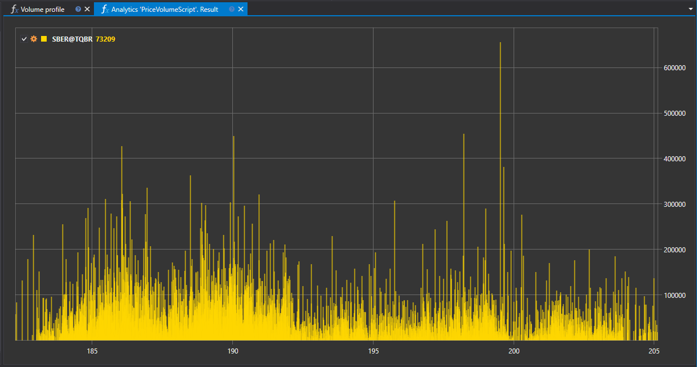

# 成交量分布

“成交量分布”脚本用于分析所选时间段内成交量在各价格水平上的分布。交易者和量化分析人员可以借此直观查看主要交易活动集中在哪些价位。



## 功能描述

脚本汇总成交数据，生成显示各价格水平成交量的分布图。该信息可以通过图表呈现，从而展示不同价位上的交易密度。

## 实际意义

分析成交量分布有助于识别关键的供需区域，并可用于：

- 识别支撑位和阻力位，即交易品种受到市场参与者显著关注的价位。
- 根据成交量分布的变化，评估当前趋势的强度或其可能出现的减弱。
- 结合累计流动性最高的价位，规划入场点和出场点。

## 在交易和量化分析中的应用

- **交易**：成交量分布可用于制定基于成交量分析的策略，清楚显示主要交易活动发生在哪些价位。
- **量化分析**：成交量分布数据可以作为量化模型的输入，根据特定价位的累计成交量预测价格变动的可能性。

## 脚本实现

“成交量分布”脚本执行以下步骤：

1. **收集数据**：汇总指定时间段内的成交数据。
2. **生成分布图**：根据收集的数据生成成交量分布图，反映各价格水平的交易活动。
3. **可视化**：将脚本运行结果显示为图表或直方图，其中每个柱形对应一个特定价格水平及其成交量。

在 StockSharp 平台中使用“成交量分布”脚本，可以开展全面的市场分析、建立有依据的交易假设，并提高交易决策的质量。

## C# 脚本代码

```cs
namespace StockSharp.Algo.Analytics
{
	/// <summary>
	/// 按价格档位计算成交量分布的分析脚本。
	/// </summary>
	public class PriceVolumeScript : IAnalyticsScript
	{
		Task IAnalyticsScript.Run(ILogReceiver logs, IAnalyticsPanel panel, SecurityId[] securities, DateTime from, DateTime to, IStorageRegistry storage, IMarketDataDrive drive, StorageFormats format, DataType dataType, CancellationToken cancellationToken)
		{
			if (securities.Length == 0)
			{
				logs.LogWarning("No instruments.");
				return Task.CompletedTask;
			}

			// 脚本只能处理 1 个工具
			var security = securities.First();

			// 获取 K线存储
			var candleStorage = storage.GetCandleMessageStorage(security, dataType, drive, format);

			// 获取指定期间内的可用日期
			var dates = candleStorage.GetDates(from, to).ToArray();

			if (dates.Length == 0)
			{
				logs.LogWarning("no data");
				return Task.CompletedTask;
			}

			// 按中间价对K线分组
			var rows = candleStorage.Load(from, to)
				.GroupBy(c => c.LowPrice + c.GetLength() / 2)
				.ToDictionary(g => g.Key, g => g.Sum(c => c.TotalVolume));

			// 绘制到图表上
			panel.CreateChart<decimal, decimal>()
				.Append(security.ToStringId(), rows.Keys, rows.Values, DrawStyles.Histogram);

			return Task.CompletedTask;
		}
	}
}

```

## Python 脚本代码

```python
import clr

# 添加 .NET 引用
clr.AddReference("StockSharp.Messages")
clr.AddReference("StockSharp.Algo.Analytics")
clr.AddReference("Ecng.Drawing")

from Ecng.Drawing import DrawStyles
from System.Threading.Tasks import Task
from StockSharp.Algo.Analytics import IAnalyticsScript
from storage_extensions import *
from candle_extensions import *
from chart_extensions import *
from indicator_extensions import *

# 按价格档位计算成交量分布的分析脚本。
class price_volume_script(IAnalyticsScript):
	def Run(
		self,
		logs,
		panel,
		securities,
		from_date,
		to_date,
		storage,
		drive,
		format,
		data_type,
		cancellation_token
	):
		# 检查是否 没有交易品种
		if not securities:
			logs.LogWarning("No instruments.")
			return Task.CompletedTask

		# 脚本只能处理 1 个工具
		security = securities[0]

		if data_type is None:
			logs.LogWarning(f"不支持的数据类型 {data_type}。")
			return Task.CompletedTask

		message_type = data_type.MessageType

		# 获取K线存储
		candle_storage = get_candle_storage(storage, security, data_type, drive, format)

		# 获取指定期间内的可用日期
		dates = get_dates(candle_storage, from_date, to_date)

		if len(dates) == 0:
			logs.LogWarning("no data")
			return Task.CompletedTask

		# 按中间价对K线分组并汇总成交量
		candles = load_range(candle_storage, message_type, from_date, to_date)
		rows_dict = {}
		for candle in candles:
			# 计算K线的中间价
			key = candle.LowPrice + get_length(candle) / 2
			# 汇总同一价格档位的成交量
			rows_dict[key] = rows_dict.get(key, 0) + candle.TotalVolume

		# 绘制到图表上
		chart = create_chart(panel, float, float)
		chart.Append(to_string_id(security), list(rows_dict.keys()), list(rows_dict.values()), DrawStyles.Histogram)

		return Task.CompletedTask

```
