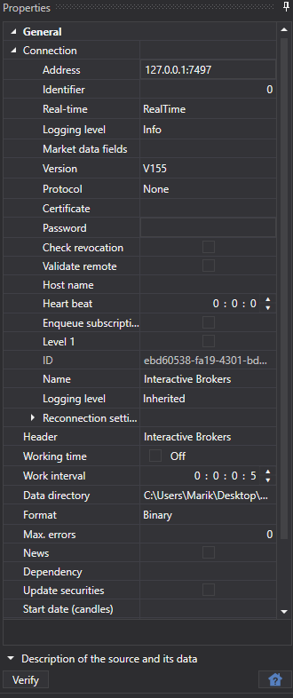

# 选择数据源

要添加新的市场数据源，请执行以下操作：

- 打开 **常规** 选项卡。
- 选择 **添加**。
- 选择 **数据源**。

随后会显示数据源列表。用户可以一次选择多个数据源。

还可以创建同一数据源的多个实例。例如，可以创建多个 **Interactive Brokers** 实例，并将下载的数据保存到不同文件夹。

要使数据源在单击 **开始** 按钮后开始下载数据，必须先启用该数据源。为此，请在左侧面板中选择数据源图标，并使用  按钮将其启用或禁用。可以在添加要下载的交易品种之前或之后执行此操作。

可以使用  按钮删除不需要的数据源。

可以在右侧的 **属性** 面板中修改数据源设置。

所有数据源共有的设置，请参阅[通用连接设置](common_connection_settings.md)。

每种连接都有自己的特性。[连接器列表](../data_sources.md)中提供了连接器及其设置的列表。

**观看[视频教程](../videos/sources_samples.md)**
