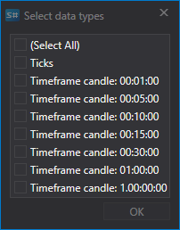

# 首次启动

首次运行程序时，会出现以下数据源选择窗口。也可以在 **常规** 选项卡中选择 **添加 \=\> 数据源** 打开此窗口。

在窗口中勾选所需的数据源。可以按地区、交易板、数据类型、付费方式以及是否提供实时数据进行筛选。选择完成后，单击 **确定**。随后程序会询问是否启用实用工具。有关实用工具的详细信息，请参阅[实用工具](tasks.md)。单击 **确定**。

之后，所选数据源会添加到应用程序主窗口的左侧面板。

## 配置市场数据下载

开始下载市场数据之前，需要配置要获取市场数据的交易品种。

添加市场数据源后，中央区域会打开相应的数据源面板，其中显示交易品种列表。如果面板已关闭，可以双击程序左侧列表中的数据源徽标重新打开。

例如，从支持的数据源下载 AAPL@NASDAQ 交易品种。

> [!TIP]
> **重要！**程序只会下载已添加到交易品种列表中的品种数据。

1. 添加交易品种。

   首次启动时，程序会询问是否立即下载所选数据源的全部交易品种。之后需要由用户自行下载交易品种。最初，[Hydra](../hydra.md) 的交易品种数据库为空，仅包含辅助交易品种 **ALL@ALL**。选择该交易品种后，程序会下载当前数据源中所有可用交易品种的数据。

   要添加交易品种，请单击 **添加** 按钮 。随后会打开交易品种下载窗口。

   要下载交易品种，请单击相应的 **下载交易品种** 按钮。

   随后屏幕上会出现一个菜单，用户可以在其中选择 **下载所有交易品种**。

   对于部分数据源，也可以[配置](prepare_for_download/instruments_list.md)需要下载的交易品种。

   接收到交易品种后，窗口将显示如下内容。

   窗口中会列出所有可添加的交易品种。要快速查找某个品种，可以在相应字段中输入其名称。

   要选择交易品种，请双击该品种，它会移动到列表右侧。

   随后，该品种会移动到表格右侧。

   所选交易品种会显示在树形结构的 **交易品种** 表格中。树的主元素是交易品种，子元素是要为该交易品种接收的市场数据类型。
2. 为每个所选交易品种选择需要下载的市场数据类型。

   如果尚未设置全部必要的交易品种参数，交易品种行左侧会显示图标 。

   下面选择下载 **逐笔成交** 和 **5 分钟K线**。

   数据源窗口底部有一个按钮面板，用于配置要接收的数据和交易品种。

   可以在该面板中执行以下操作：
   - 使用 **成交、订单簿、K线、订单日志、Level 1、自有交易** 按钮配置要接收的信息类型。不同数据源支持的市场数据类型列表可能不同。
   - 指定要加载的K线时间周期。不同数据源提供的K线时间周期也可能不同。
   - 设置市场数据的下载时间范围。也可以直接在市场数据窗口中配置该范围，为此需要选择开始和结束时间。

     如果用户未指定结束日期，程序会下载截至当前日期的全部可用数据。如果数据源支持实时传输市场数据，并且未指定结束日期，程序还会继续实时下载市场数据。

     设置需要下载市场数据的时间范围。
   - 指定用于构建K线的市场数据。如果未设置此参数，程序将接收数据源中直接提供的K线。如果用户指定了市场数据类型，则会使用该类型的数据构建K线。例如，可以根据最新成交价、订单簿价差（通常用于外汇市场）、波动率或最优价格构建K线。

     如果数据源无法直接提供绘制K线所需的数据，此功能会非常有用。在这种情况下，程序会根据平均数据值绘制K线。

     用户还可以选择K线的[自定义类型](prepare_for_download/custom_candles.md)，以调整接收的数据。
   - 选择交易品种和市场数据类型并设置时间范围后，单击 **开始** 按钮。随后程序会开始下载市场数据。

   可以在程序底部固定的 **日志** 选项卡中观察运行过程。此外，日志也会保存到本地文件夹中的文件内。

用户还可以添加[其他数据源](data_sources/select_source.md)。

下载市场数据后，用户可以[查看市场数据](working_with_data/view_and_export.md)、[绘制K线](working_with_data/candles_generation.md)，以及保存数据或[导出为各种格式](working_with_data/export_data.md)。

**观看[视频教程](videos/first_start.md)**。
