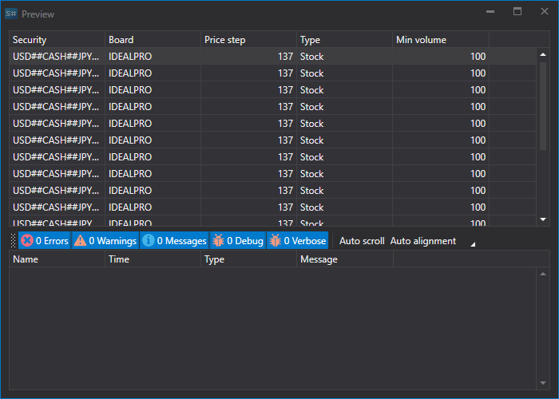

# 交易品种

要导入交易品种，请打开 **Import \=\> Instruments** 选项卡。


## 导入过程

1. **导入设置**

   请参阅[蜡烛图](candles.md)导入说明。
2. 配置 [S\#](../../api.md) 字段的导入参数。

   请参阅[蜡烛图](candles.md)导入说明。

   **下面以从 CSV 文件导入交易品种为例：**
   - 要导入数据的文件使用以下模板：

     ```none
     {SecurityId.SecurityCode};{SecurityId.BoardCode};{PriceStep};{SecurityType};{VolumeStep}
     	  				
     ```

     其中，{SecurityId.SecurityCode} 和 {SecurityId.BoardCode} 分别对应 **Security** 和 **Board**。因此，在 **Field order** 字段中分别为其分配序号 0 和 1。
   - 对于 {PriceStep} 字段，在 **S\# field** 窗口中选择 **Nominal**，并将其序号设为 2。
   - 对于 {SecurityType} 字段，在 **S\# field** 窗口中选择表示交易品种类型（股票、货币、期货等）的 **Type**，并将其序号设为 3。
   - 对于 {VolumeStep} 字段，在 **S\# field** 窗口中选择表示基础或最小交易数量的 **Min volume (base)**，并将其序号设为 4。
   - 字段设置窗口将如下所示：

   用户可以为导入的数据配置大量属性。需要根据导入文件模板指定属性，并为其分配对应的排列序号。
3. 要预览数据，请单击 **Preview** 按钮。
4. 单击 **Import** 按钮。
