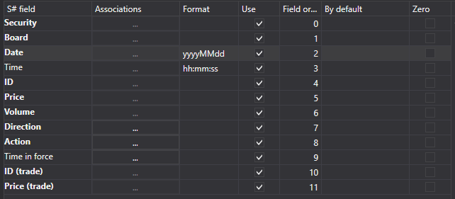
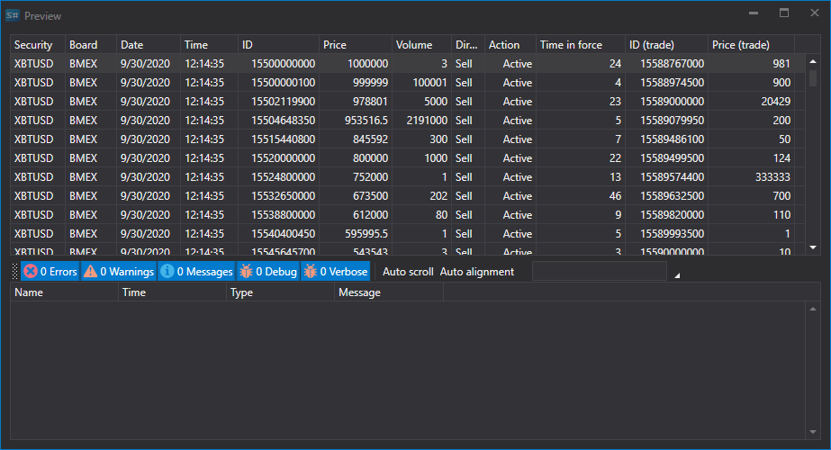

# 订单日志

要导入订单日志，请在应用程序主菜单中选择 **导入 \=\> 订单日志**。


## 导入过程

1. **导入设置**

   请参阅[K线](candles.md)导入说明。
2. 配置 [S#](../../api.md) 字段的导入参数。

   请参阅[K线](candles.md)导入说明。

   **下面以从 CSV 文件导入订单日志为例：**
   - 要导入数据的文件使用以下模板：

     ```none
     {SecurityId.SecurityCode};{SecurityId.BoardCode};{ServerTime:default:yyyyMMdd};{ServerTime:default:HH:mm:ss.ffffff};{OrderId};{OrderPrice};{OrderVolume};{Side};{OrderState};{TimeInForce};{TradeId};{TradePrice}
     	  				
     ```

     其中，{SecurityId.SecurityCode} 和 {SecurityId.BoardCode} 分别对应 **交易品种** 和 **交易板块**。因此，在 **字段顺序** 字段中分别为其分配序号 0 和 1。
   - 对于 {ServerTime:default:yyyyMMdd} 和 {ServerTime:default:HH:mm:ss.ffffff} 字段，在 **S# 字段** 窗口中分别选择 **日期** 和 **时间**，并将其序号设为 2 和 3。
   - 对于 {OrderId} 字段，在 **S# 字段** 窗口中选择表示订单 ID 的 **ID**，并将其序号设为 4。
   - 对于 {OrderPrice} 字段，在 **S# 字段** 窗口中选择表示订单价格的 **价格**，并将其序号设为 5。
   - 对于 {OrderVolume} 字段，在 **S# 字段** 窗口中选择表示订单数量的 **数量**，并将其序号设为 6。
   - 对于 {Side} 字段，在 **S# 字段** 窗口中选择表示订单方向（买入或卖出）的 **方向**，并将其序号设为 7。
   - 对于 {OrderState} 字段，在 **S# 字段** 窗口中选择表示订单状态（活动、非活动或错误）的 **操作**，并将其序号设为 8。
   - 对于 {TimeInForce} 字段，在 **S# 字段** 窗口中选择表示限价订单执行条件的 **Time in force**，并将其序号设为 9。
   - 对于 {TradeId} 字段，在 **S# 字段** 窗口中选择表示成交标识符的 **ID（成交）**，并将其序号设为 10。
   - 对于 {TradePrice} 字段，在 **S# 字段** 窗口中选择表示成交价格的 **价格（成交）**，并将其序号设为 11。
   - 字段设置窗口将如下所示：

   用户可以为导入的数据配置大量属性。需要根据导入文件模板指定属性，并为其分配对应的排列序号。
3. 要预览数据，请单击 **预览** 按钮。
4. 单击 **导入** 按钮。
