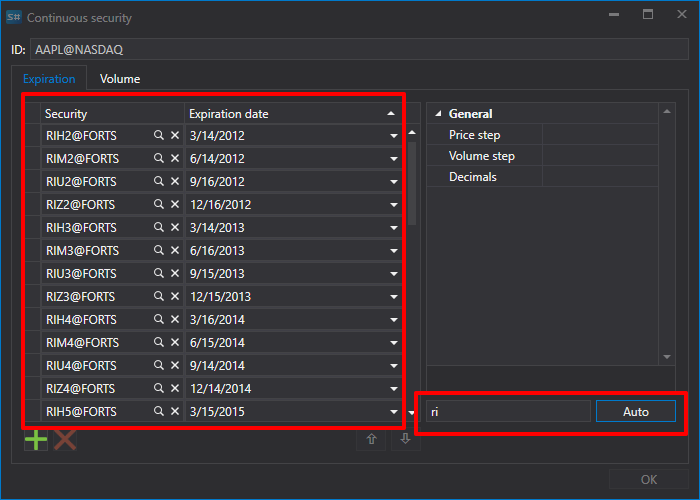
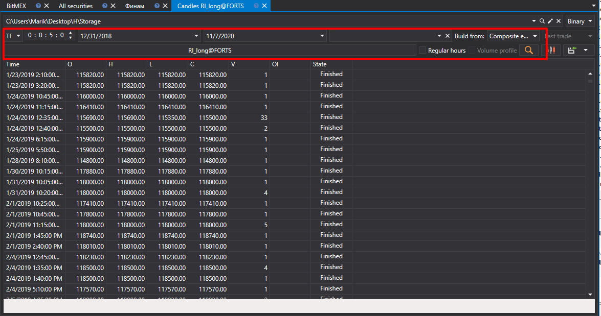

# 连续期货

[Hydra](../../hydra.md) 可以将不同合约的各类市场数据合并到一个连续交易品种中。

为此，请在 **Common** 选项卡中选择 **Securities**，以显示 **All securities** 选项卡。合并数据前，请先检查可用的市场数据。选择数据所在的路径，然后依次查看准备合并的交易品种。如果数据存在缺口，请下载缺失的市场数据（例如，从支持的数据源下载）。

下面以合并 E-mini S&P 500 期货为例。

1. 要创建连续期货合约，请在 **All securities** 选项卡中单击 **Create security \=\> Continuous security** 按钮。

   随后将显示以下窗口：
2. 创建连续期货时，需要指定名称并添加合约。

   添加合约有两种方式。
   - 单击  按钮手动添加。
   - 将合约名称设为其前两个字母（例如 RI），然后单击 **Auto** 按钮，数据库中找到的所有相关交易品种都会被添加。
3. 选择所需合约并设置各合约的切换日期。
4. 接下来，指定交易品种标识符 **ES\_continuous@CME** 并单击 **OK** 按钮，随后将创建一个新交易品种。
5. 然后，在 **Common** 选项卡中单击 [Candles](../working_with_data/view_and_export/candles.md) 按钮，选择生成的交易品种和数据时间段，在 **Build from** 字段中选择 **Composite element**，再单击  按钮。

生成的数据可以导出为 Excel、XML、JSON 或 TXT 格式。通过下拉列表选择导出格式。

