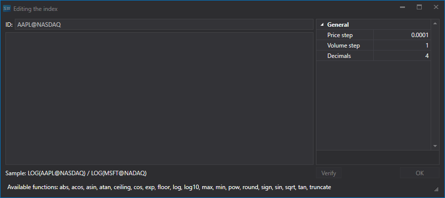

# 指数

使用 [Hydra](../../hydra.md)，可以创建自定义指数。

在 **常规** 选项卡中选择 **交易品种**，此时会显示 **所有交易品种** 选项卡。

创建**指数**前，请先检查可用的市场数据。选择数据的存储路径，然后依次查看应参与指数计算的交易品种。如果数据存在缺口，请从支持的数据源下载所需的市场数据。

下面以交易品种比值指数 AAPL@NYSE\/GOOG@NYSE 为例。

1. 第一步是创建 **指数**。在 **所有交易品种** 选项卡中单击 **创建交易品种 => 指数**。
2. 将显示以下窗口：
3. 创建 **指数** 交易品种时，需要指定名称，并添加由多个交易品种组成的数学公式。除标准数学运算符外，还可以使用以下函数：

- **abs(a)** \- 返回数字的绝对值。
- **acos(a)** \- 返回余弦值等于指定数字的角度。
- **asin(a)** \- 返回正弦值等于指定数字的角度。
- **atan(a)** \- 返回正切值等于指定数字的角度。
- **ceiling(a)** \- 返回大于或等于指定数字的最小整数。
- **cos(a)** \- 返回指定角度的余弦值。
- **exp(a)** \- 返回 e 的指定次幂。
- **floor(a)** \- 返回小于或等于指定数字的最大整数。
- **log(a)** \- 返回指定数字的自然对数（以 e 为底）。
- **log10(a)** \- 返回指定数字以 10 为底的对数。
- **max (a, b)** \- 返回两个小数中较大的一个。
- **min(a, b)** \- 返回两个小数中较小的一个。
- **pow(a, b)** \- 返回指定数字的指定次幂。
- **sign(a)** \- 返回一个表示指定数字符号的整数。
- **sin(a)** \- 返回指定角度的正弦值。
- **sqrt (a)** \- 返回指定数字的平方根。
- **tan(a)** \- 返回指定角度的正切值。
- **truncate(a)** \- 计算指定数字的整数部分。

4. 输入用于计算指数的数学运算。
5. 接下来，在 **常规** 选项卡中单击 [K线](../working_with_data/view_and_export/candles.md) 按钮，选择已创建的 **指数** 交易品种和数据时间段，在 **创建来源:** 字段中选择 **复合元素**，然后单击 。

生成的数据可以导出为 Excel、XML 或 TXT 格式。通过下拉列表选择导出格式。

