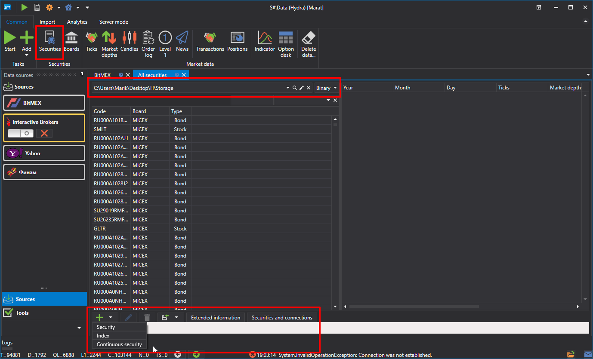

# 交易品种列表

在 General 选项卡中单击 **Instruments** 按钮后，会显示 **Instruments** 面板。该面板列出了所有可用交易品种及其市场数据。

**Instruments** 面板底部的按钮可用于：

- 添加新交易品种，详见[创建交易品种](create_instrument.md)。
- 添加新指数，详见[指数](index.md)。
- 添加新的连续交易品种，详见[连续期货](continuous_futures.md)。
- 修改交易品种或一组交易品种，详见[编辑交易品种](editing_instruments.md)。
- 指定交易品种的附加信息，详见[交易品种扩展信息](extended_instrument_info.md)。
- 匹配交易品种与连接，详见[匹配交易品种与连接](matching_instruments_connections.md)。
