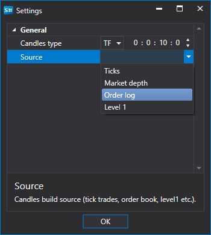
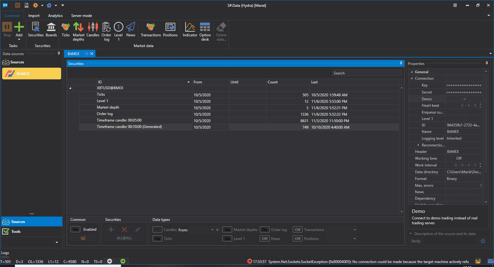
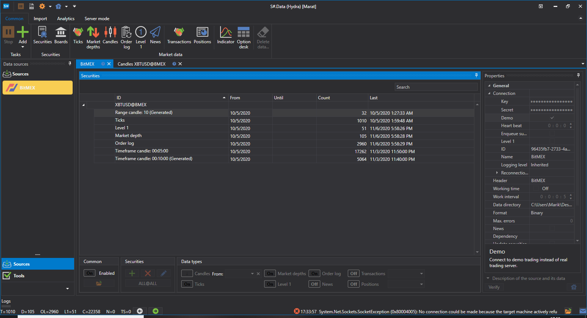

# 自定义K线

用户可以选择K线的 **自定义类型**，自行指定要构建的K线。K线会即时动态生成。

下面来看一个构建示例。**Bitmex** 交易所不提供 10 分钟时间周期的K线。

获取此类K线的步骤如下：

1. 选择 **自定义** K线。
2. 在设置中选择 **TF** K线，并将时间周期设为 10 分钟。
3. 在数据源设置中指定用于构建K线的数据类型：**订单日志**。
4. 设置下载时间范围。可以看到，K线名称旁边出现了 **已生成** 标记。
5. 单击开始，程序开始下载数据。
6. 打开K线部分并[查看下载的数据](../working_with_data/view_and_export.md)。

可以看到，数据已成功接收。

下面再看一个需要获取 [RangeCandleMessage](xref:StockSharp.Messages.RangeCandleMessage) 的示例：

1. 选择 **自定义** K线。
2. 在设置中选择范围K线，并将价格范围设为 10。
3. 在数据源设置中指定用于构建K线的数据类型：**逐笔成交**。
4. 设置下载时间范围。
5. 单击开始，程序开始下载数据。
6. 打开K线部分并[查看下载的数据](../working_with_data/view_and_export.md)。
