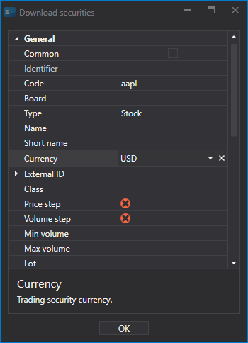
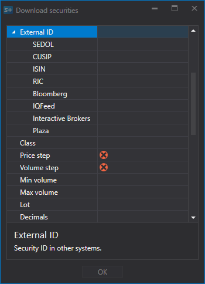

# 交易品种列表

配置要下载的交易品种。

部分数据源允许设置筛选条件，只下载所需的交易品种。

下面以从 **Interactive Brokers** 数据源下载交易品种为例：

1. 选择下载交易品种，然后单击 **扩展条件** 按钮。
2. 随后会打开用于下载交易品种的高级设置列表。
3. 假设需要下载满足以下条件的交易品种：APPLE 股票，货币为美元。请按下图设置交易品种参数，然后单击 **OK**。

   随后，[Hydra](../../hydra.md) 会下载符合指定条件的所有交易品种。

这些设置允许用户根据多种参数筛选要下载的交易品种。

例如，可以设置：

- **价格步长和数量步长**
- **最小和最大数量**
- **外部 ID** 
- 对于期权，可以设置**标的资产**和**资产类型**（标的资产类型）。

**观看[视频教程](../videos/instruments_downloading.md)**
