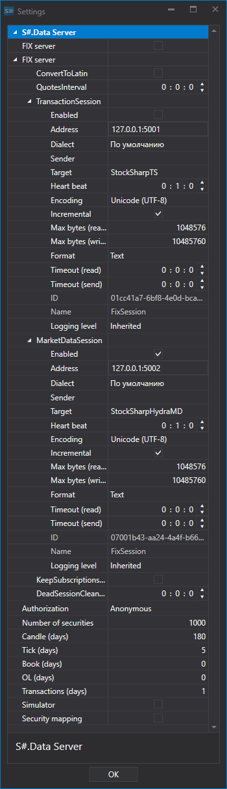

# 设置

[Hydra](../../hydra.md) 可以在服务器模式下运行。在此模式下，远程客户端可以连接到 [Hydra](../../hydra.md)，并获取存储中已有的数据。客户端可以连接到服务器模式下的 [Hydra](../../hydra.md)，例如使用 [Designer](../../designer.md)；具体方法请参阅[入门](../../designer/market_data_storage/getting_started.md)，该页面位于 [Designer](../../designer.md) 文档中。也可以连接到 [Hydra](../../hydra.md) 并通过 [API](../../api.md) 访问数据，详情请参阅 [FIX/FAST 连接](fix_fast_connectivity.md)。

服务器模式允许多个程序同时共用 [Hydra](../../hydra.md) 中的一个连接。用户在程序设置中指定访问密钥后，即可通过同一个账户同时使用同一个数据源。

实际上，程序通过 [Hydra](../../hydra.md) 连接数据源，例如 [Designer](../../designer.md) 和 [Terminal](../../terminal.md) 可以同时连接到 Hydra。这样无需在程序之间反复重新连接，也不必购买额外连接。同时，可以避免不同程序注册订单或执行交易时产生冲突。[Hydra](../../hydra.md) 接收请求后，会将结果返回给发出请求的程序，而不会影响其他程序的操作顺序。

要启用 [Hydra](../../hydra.md) 服务器模式，请在程序顶部菜单中选择 **Server mode** 选项卡。

然后单击 **Settings** 按钮，打开服务器模式设置窗口。

**Hydra Server**

- **FIX server** \- 将 [Hydra](../../hydra.md) 切换到服务器模式，通过 FIX 协议分发实时交易数据和历史数据。

  在此部分中配置用于访问数据源的连接：
  1. **ConvertToLatin** \- 将西里尔字符转换为拉丁字符。
  2. **QuotesInterval** \- 行情更新周期。
  3. **TransactionSession** \- 交易会话设置，用于通过 [Hydra](../../hydra.md) 进行交易。

     此设置可用于配置 FIX 协议方言、发送方和接收方、数据格式及其他参数。详情请参阅 [FIXServer 属性](https://doc.stocksharp.ru/html/Properties_T_StockSharp_Fix_FixServer.htm)。
  4. **MarketDataSession** \- 配置通过 [Hydra](../../hydra.md) 接收的市场数据的传输。详情请参阅 [FIXServer 属性](https://doc.stocksharp.ru/html/Properties_T_StockSharp_Fix_FixServer.htm)。
  5. **KeepSubscriptionsOnDisconnect** \- 与数据源断开连接后保留订阅。
  6. **DeadSessionCleanupInterval** \- 连接断开后，经过多长时间清除相关信息。
- **Authorization** \- 访问 Hydra 服务器时使用的身份验证方式。
- **Number of securities** \- 可从服务器请求的最大证券数量。
- **Candles (days)** \- 可下载的蜡烛历史数据的最大天数。
- **Ticks (days)** \- 可下载的逐笔成交历史数据的最大天数。
- **Order books (days)** \- 可下载的订单簿历史数据的最大天数。
- **OL (days)** \- 可下载的订单日志数据的最大天数。
- **Transactions (days)** \- 可下载的事务历史数据的最大天数。
- **Simulator** \- 启用仿真模式。
- **Security mapping** \- 启用仅传输指定证券的模式。

如果将 **Authorization** 设置为 **Anonymous** 以外的选项，**Common** 选项卡中将显示 **Users** 按钮。单击该按钮后会打开 **Users** 窗口。

可以在窗口左侧添加新用户，并在右侧为用户设置访问权限。
