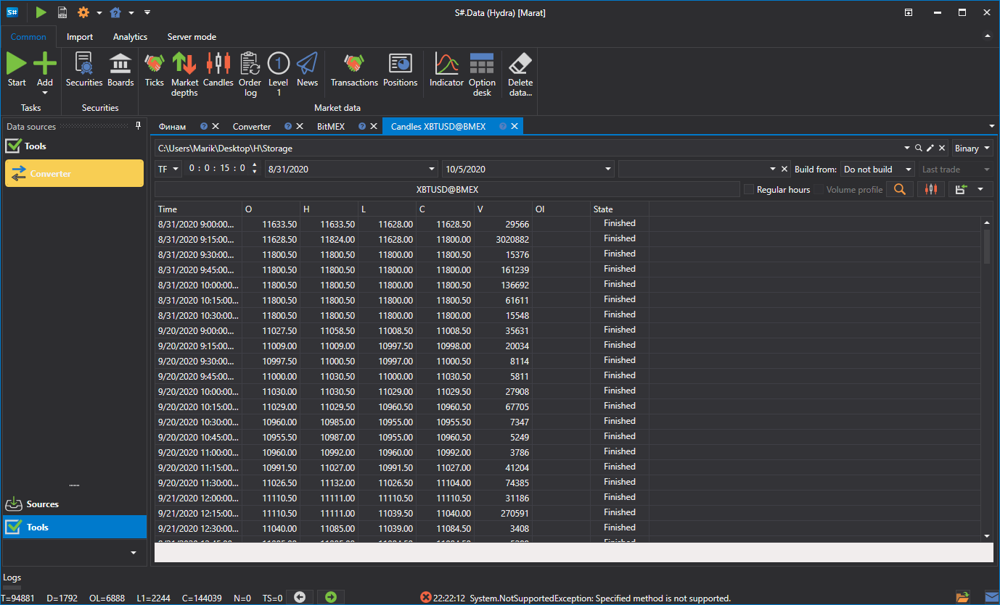

# 转换器

该任务用于转换交易所数据，例如将订单日志转换为逐笔成交，或将逐笔成交转换为K线等。

**Converter**

- **Converter** — 转换器。
- **From** — 要转换的源数据类型。
- **Data format** — 转换后的数据格式。
- **Start date** — 开始转换数据的日期。
- **Time offset** — 相对于任务启动日期的偏移天数，用于避免转换不完整交易日的数据。如果配置了实时数据转换，受更新间隔影响，当前交易日的数据可能尚未完整。设置时间偏移可以避免转换此类不完整数据。
- **Where** — 保存转换后数据的数据目录。

**Order books**

- **Interval** — 订单簿生成间隔。
- **Depth** — 生成订单簿时的最大深度。
- **Order log** — 从订单日志构建订单簿的方式。

  每个交易所都有自己的 **Order Log** 格式，[Hydra](../../hydra.md) 支持以下三种格式：
  - **By default** — 适用于大多数情况。
  - **ITCH** — 用于 ITCH 协议，例如 LSE 和 Nasdaq 交易所。

**General**

- **Header** — Converter。
- **Working hours** — 配置交易板的工作时间表。
- **Interval of operation** — 任务的运行间隔。
- **Data directory** — 用于接收待转换数据的数据目录。
- **Format** — 转换后的数据格式：BIN\/CSV。
- **Max. errors** — 任务停止前允许出现的最大错误数。默认值为 0，表示忽略错误数量。
- **Dependency** — 启动当前任务前必须完成的任务。

**Logging**

- **Identifier** — 标识符。
- **Logging level** — 日志记录级别。

下面以一个数据转换示例说明操作过程。

1. 打开 **Converter** 任务。
2. 选择交易品种，然后在打开的窗口中设置转换后需要得到的数据类型，以及用于转换的源数据类型。例如，将逐笔成交转换为 15 分钟时间周期的K线。

   > [!TIP]
   > **重要！**要生成的数据时间范围必须与可供转换的数据时间范围相对应，否则数据无法转换。还必须在设置中正确指定源数据格式，使其与实际待转换数据的格式一致。
3. 指定所需目录、时间偏移和运行间隔。
4. 启动转换。

转换完成后，可以[查看](../working_with_data/view_and_export.md)生成的数据。

此功能与通过其他数据类型[生成所需市场数据](../working_with_data/any_market_data_types.md)类似。

**观看[视频教程](../videos/converter_task.md)**
