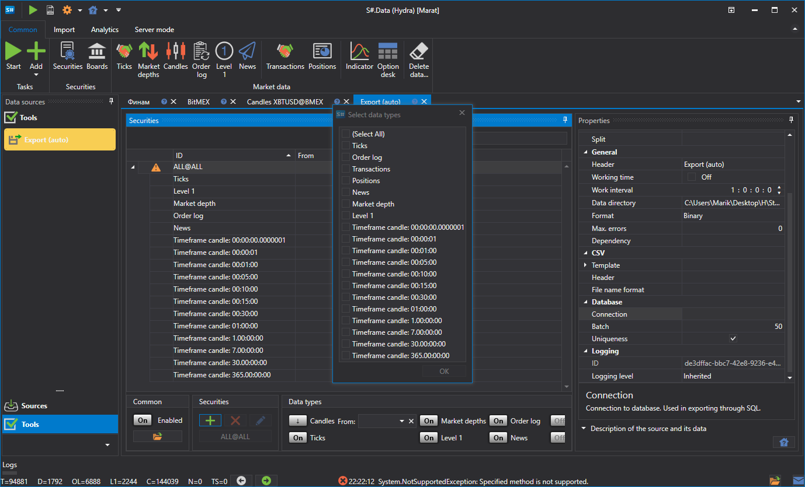

# 自动导出

该任务用于将交易所数据导出为 Excel、xml、sql、bin、Json 或 txt 等格式。

**Database**

- **Connection** — 数据库连接，用于通过 SQL 导出。
- **Packet** — 传输数据包的大小，默认值为 50 个元素，用于通过 SQL 导出。
- **Uniqueness** — 检查数据库中数据的唯一性。该选项会影响性能，默认启用，用于通过 SQL 导出。

> [!TIP]
> 使用 SQL 导出时，需要设置连接字符串参数。

**New connection string**

- **Provider** — 数据库提供程序设置。
- **Server** — 服务器地址或数据库路径。
- **Database** — 数据库名称。SQLite 不使用此参数。
- **Login** — 访问数据库的登录名。匿名访问不使用此参数。
- **Password** — 访问数据库的密码。匿名访问不使用此参数。
- **Windows** — 使用当前 Windows 账户连接数据库。
- **Connection** — 完整的连接字符串。

> [!TIP]
> 可以使用 **Check** 按钮检查数据库连接。

**General**

- **Header** — Converter。
- **Working hours** — 配置交易板的工作时间表。
- **Interval of operation** — 任务的运行间隔。
- **Data directory** — 用于接收待转换数据的数据目录。
- **Format** — 转换后的数据格式：BIN\/CSV。
- **Max. errors** — 任务停止前允许出现的最大错误数。默认值为 0，表示忽略错误数量。
- **Dependency** — 启动当前任务前必须完成的任务。

**CSV**

- **Templates** — 各种导出数据类型使用的模板。
- **Header** — 文件第一行中的标题。如果传入空字符串，则不会向文件添加标题。
- **Name format** — 导出文件名的记录格式。

**Export (auto)**

- **Type** — 导出类型（格式）。
- **Start date** — 开始导出数据的日期。
- **Time offset** — 以天为单位的时间偏移。
- **Export directory** — 数据导出目录。
- **Format** — 数据格式。
- **Split** — 拆分类型。

**Logging**

- **Identifier** — 标识符。
- **Logging level** — 日志记录级别。

下面以自动导出为例说明操作过程：

1. 选择交易品种。
2. 配置需要导出的市场数据。
3. 设置导出时间范围。如果已经配置实时下载市场数据，可以不指定结束日期。在这种情况下，数据会按照运行间隔（数据更新间隔）实时导出。
4. 配置目录、运行间隔、数据类型和数据格式。
5. 启动导出。

查看导出的数据：

**观看[视频教程](../videos/export_task.md)**
