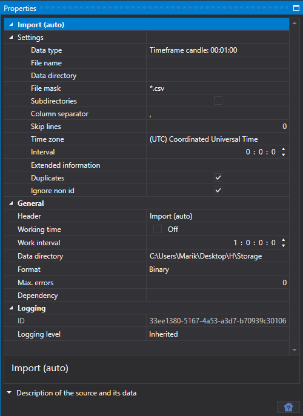

# 自动导入

该任务会按照指定的文件掩码，自动从指定目录中的文件导入交易所数据。

每种所选市场数据类型的模板都在[导入](../importing.md)选项卡中配置。

在面板底部，可以选择要导入数据的交易品种以及要导入的数据类型。

可以为每个交易品种指定以下数据导入属性：

**导入（自动）**

**设置**

- **数据类型** — 导入的数据类型。
- **文件名** — 文件的完整路径。
- **数据目录** — 数据目录。
- **文件掩码** — 扫描目录时使用的文件掩码，例如 `candles\*.csv`。
- **子目录** — 是否包含子目录。
- **列分隔符** — 列分隔符。制表符使用 TAB 表示。
- **从文件开头跳过** — 从文件开头跳过的行数，用于忽略包含元信息的行。
- **时区** — 时区。
- **间隔** — 数据更新频率。
- **扩展信息** — 将导入的扩展字段保存到扩展信息存储中。
- **重复项** — 如果重复的交易品种已存在，是否对其进行更新。
- **忽略无 ID 项** — 忽略没有标识符的交易品种。

**常规**

- **标题** — Converter。
- **工作时间** — 配置交易板的工作时间表。
- **操作间隔** — 任务的运行间隔。
- **数据目录** — 用于接收待转换数据的数据目录。
- **格式** — 转换后的数据格式：BIN\/CSV。
- **最大错误数** — 任务停止前允许出现的最大错误数。默认值为 0，表示忽略错误数量。
- **依赖任务** — 启动当前任务前必须完成的任务。

**日志**

- **标识符** — 标识符。
- **日志级别** — 日志记录级别。
