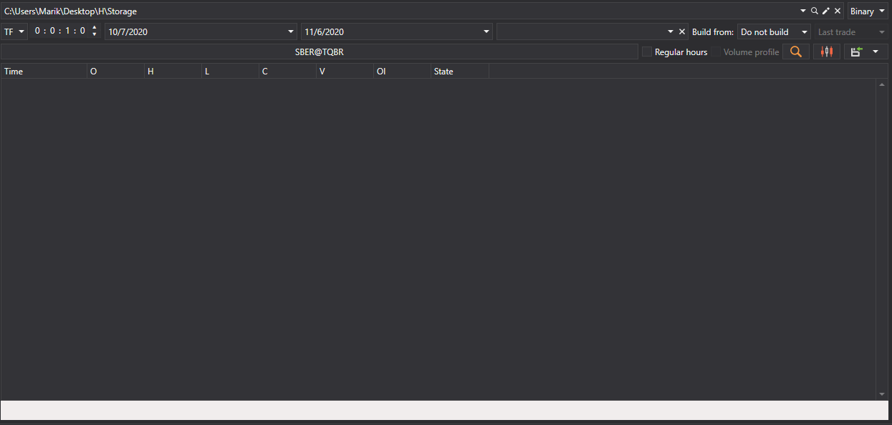
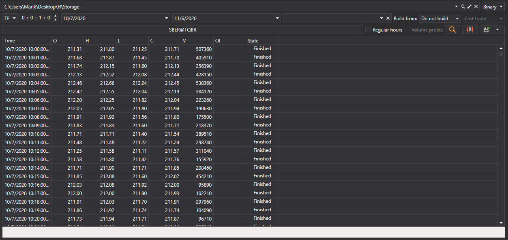

# 生成K线

[Hydra](../../hydra.md) 可以根据已下载的成交数据生成多种类型的K线，随后可将其导出为 [Excel](https://en.wikipedia.org/wiki/Excel)、XML、SQL、BIN、JSON 或 TXT 格式。

因此，生成的数据可以在 WealthLab、AmiBroker 等任意技术分析程序中使用。

## K线生成过程

1. 在 **常规** 选项卡中单击 **K线** 按钮，打开以下窗口：

   

2. 在打开的窗口中配置K线生成参数：

   - 从下拉列表中选择所需的K线类型，支持所有[标准K线类型](../../api/candles.md)。
   - 指定所选K线类型所需的参数：
     - 对于 [TimeFrameCandleMessage](xref:StockSharp.Messages.TimeFrameCandleMessage)，选择 **时间周期**。
     - 对于 [VolumeCandleMessage](xref:StockSharp.Messages.VolumeCandleMessage)，指定 **成交量**。
     - 对于 [TickCandleMessage](xref:StockSharp.Messages.TickCandleMessage)，指定 **Tick 数量**。
     - 对于 [RangeCandleMessage](xref:StockSharp.Messages.RangeCandleMessage)，指定 **区间**。
     - 对于 [RenkoCandleMessage](xref:StockSharp.Messages.RenkoCandleMessage)，指定 **砖块大小**。
     - 对于 [PnFCandleMessage](xref:StockSharp.Messages.PnFCandleMessage)，指定 **P&F 参数**。
   - 选择要为其生成K线的交易品种。
   - 根据需要指定时间范围。
   - 单击  按钮开始生成。

### 生成时间周期K线的示例

要为 AAPL@NASDAQ 交易品种生成 5 分钟K线：

1. 选择K线类型 [TimeFrameCandleMessage](xref:StockSharp.Messages.TimeFrameCandleMessage)。
2. 将 **时间周期** 设置为 5 分钟。
3. 选择 AAPL@NASDAQ 交易品种。
4. 单击搜索按钮。

数据生成后会显示以下结果：

### 生成成交量K线的示例

要生成成交量K线：

1. 选择K线类型 [VolumeCandleMessage](xref:StockSharp.Messages.VolumeCandleMessage)。
2. 指定成交量，例如 100。
3. 选择交易品种。
4. 在 **构建来源** 字段中选择 **逐笔成交**。
5. 单击搜索按钮。

生成结果：

## 用于构建K线的数据源

如果无法直接从数据源获取市场数据，可以在 [**构建来源**](any_market_data_types.md) 字段中选择用于构建K线的数据类型：

- **逐笔成交** — 使用逐笔成交数据构建K线。
- **订单簿** — 使用订单簿数据构建K线。
- **Level1** — 使用 Level1 数据构建K线。
- **较小时间周期** — 使用较小时间周期的K线构建较大时间周期的K线。

### 不同构建方式的示例

- 使用逐笔成交构建 10 分钟K线：

  

- 使用 5 分钟K线构建 30 分钟K线：

  

> [!TIP]
> 如果在 **构建来源** 字段中选择 **不构建**，程序只会搜索直接通过数据源下载的现成K线。

## 显示生成的K线

要以图形方式显示生成的K线：

1. 单击  按钮。
2. 程序会打开包含已构建K线的图表：

   

   

## 向图表添加指标

可以向K线图表添加技术指标：

1. 右键单击图表面板，打开上下文菜单。
2. 选择 **指标**，然后从列表中选择所需指标。
3. 要在单独的面板中显示指标：
   - 使用  按钮添加新面板。
   - 从上下文菜单中选择所需指标。

添加指标后的图表示例：

## 导出数据

可以将生成的K线值[导出为各种格式](export_data.md)，以便在其他程序中使用。

**另请观看有关构建各种K线的[视频教程](../videos/building_candles.md)**
