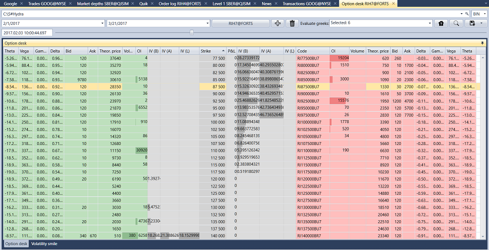

# 期权面板

在打开的窗口中选择所需时间范围和标的资产，为该标的添加期权，然后单击  按钮：

如果没有历史数据，但有价差数据，可以计算主要的希腊字母指标，包括 Delta、Gamma、Vega、Theta、Rho 和隐含波动率。为此，请在 **计算希腊字母指标** 字段中选择所需指标。

要查看**波动率微笑**，请打开 **波动率微笑** 选项卡。

找到的数据可以[导出为所需格式](../export_data.md)。
