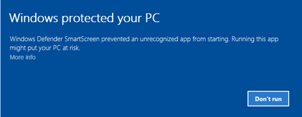

# 首次运行

1. 要安装 [Installer](../installer.md)，请打开[下载](https://stocksharp.com/products/download/)页面：
   
    

2. 下载 [Installer](../installer.md) 安装包。
3. 运行安装文件 **stocksharp_setup.exe**，然后按照安装向导的提示操作。
4. 有时 Windows 不会立即启动安装，而是显示警告：

   

5. 遇到这种情况时，请单击警告窗口中的 **更多信息** 链接，随后会出现以下窗口：

    

    单击 **仍要运行** 按钮即可开始安装 [Installer](../installer.md)。

6. 随后 [Installer](../installer.md) 将解压文件，请等待该过程完成。
7. 首次启动时，需要输入您的 **StockSharp** 用户名和密码。

    

    您既可以直接输入账户凭据登录，也可以通过社交网络授权登录。如果您此前通过社交网络在 StockSharp 网站注册，则不会设置密码。

8. 登录后，程序窗口将打开：

**观看[视频教程](videos/setup.md)**

## 另请参阅

[安装和卸载程序](install_and_remove_apps.md)
